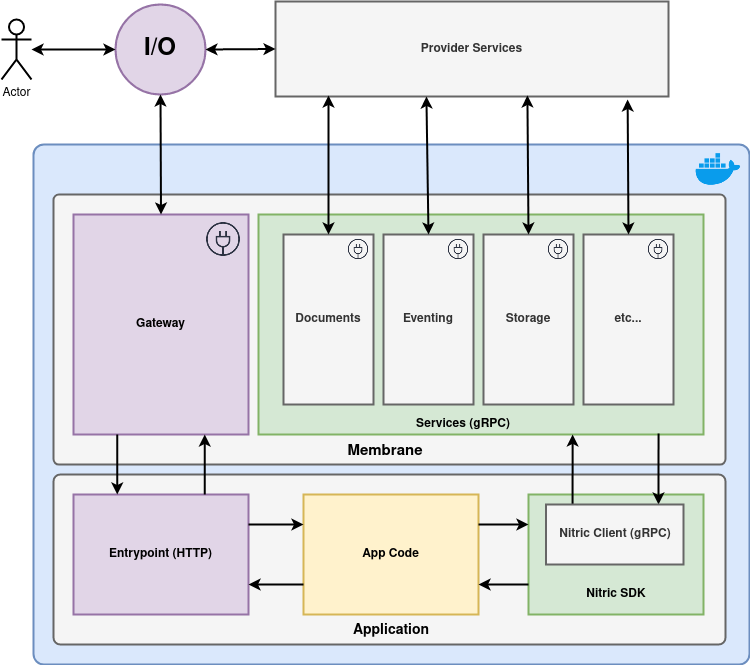

# Nitric Membrane

## Architecture

The Nitric membrane is designed to seperate application code from the non-functional concerns of an application's hosting environment.

<p align="center">
  
</p>

Documenation on key components is availabe in the [Membrane SDK](./plugins/sdk/README.md).

## Membrane Build Options
The Nitric Membrane comes in two variants `Pluggable` or `Static`.

### Static
For each supported provider (e.g. AWS or GCP) we provide a static binary which includes all the supported services for that provider.
The static membrane binaries are far smaller overall than using a pluggable binary with separate plugin files. This is the most efficient option
when running Nitric on a single provider or when custom service implementations aren't required.

### Pluggable
In cases where provider or service implementation flexibility is needed use the pluggable membrane. The pluggable 
membrane loads service implementations (e.g. S3 implementation of the Storage service for AWS) via Go Plugin Service
Factories. This enables runtime loading of service implementations, as well as custom service implementations within a
provider instead of the defaults from the static membrane.

> Service implementation customization and multiplexing is currently unimplemented.

## Development

### Requirements
 - Git
 - Golang
 - Make
 - Docker
 - Google Protocol Buffers Compiler

### Getting Started

#### Install dependencies
```bash
make install-tools
```

##### Protocol Buffers
Download the Google Protobuf Compiler (standalone binary called `protoc`) from https://github.com/protocolbuffers/protobuf and add it to your $PATH.

> On Mac OS with Homebrew, you can run `brew install protobuf`

#### Run tests
```bash
make tests
```

### Build Pluggable Membrane
```bash
# Build all of the Service Factory plugins
make plugins
```

#### Building Pluggable Membrane Images

##### Alpine Linux

```bash
make membrane-docker-alpine
```

##### Debian

```bash
make membrane-docker-debian
```

##### Both
```bash
make membrane-docker
```

### Build Static Membranes

#### Building Static Membrane

##### AWS

###### Standard Binary

> Linux support only - used in container images and for production.

```bash
make aws-static
```

###### Cross-platform Binary

Useful for local testing

```bash 
make aws-static-xp
```

###### Container Images

```bash
make aws-docker
```

##### Google Cloud Platform

###### Standard Binary

> Linux support only - used in container images and for production.

```bash
make gcp-static
```

###### Cross-platform Binary

Useful for local testing

```bash 
make gcp-static-xp
```

###### Container Images

```bash
make gcp-docker
```

##### Dev Membrane

> Note: the Dev Membrane should only be used for local development and testing.

###### Standard Binary

The dev binary is always cross-platform, since it doesn't need to be optimized for production deployments.

```bash
make dev-static
```

###### Container Images

```bash
make dev-docker
```

 
### Run Locally

To run the membrane server locally, perform a local build of the membrane binary for the platform you're targeting, then run the resulting binary.

##### Example building and running the static Google Cloud Membrane locally

```bash
# Make the GCP Static Cross-platform binary
make gcp-static-xp

# Run the membrane binary
./bin/membrane
```

> Note: for the AWS membrane, the Lambda Gateway (default) will fail to start. Instead, set the `GATEWAY_ENVIRONMENT` environment variable so that the HTTP gateway is launched instead.

```bash
# Make the AWS Static Cross-platform binary
make aws-static-xp

# Set environment variable in subshell, then run the membrane binary
(export GATEWAY_ENVIRONMENT=http; ./bin/membrane)
```

 