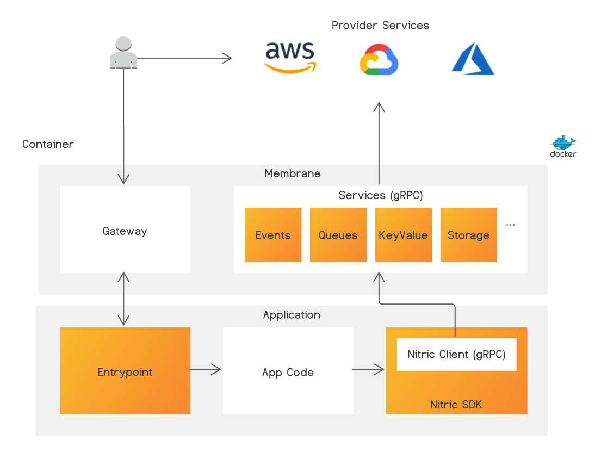

<p align="center">
  
</p>


[](https://codecov.io/gh/nitrictech/membrane)
[](https://sonarcloud.io/dashboard?id=nitrictech_membrane)

Nitric is a portable, provider independent runtime for cloud-native and serverless applications. Using Nitric applications can take advantage of cloud-native services for activities like eventing, queues, compute, CDN, storage, caches, etc. without direct integration to product specific APIs.

This decoupling enables applications to remain portable between cloud-providers and alternate deployment options such as Kubernetes or stand-alone servers, from a single application codebase. Nitric also takes an _intention based design_ approach to applications, where services and their resources are described in terms of how they should behave, allowing Nitric to ensure that behavior across a variety of providers and services.

[Read the docs](https://nitric.io/docs) to get started.

# Nitric Membrane

The Membrane is at the heart of the solution. Nitric applications communicate with the Membrane via gRPC to access the following services in a provider agnostic way:

  - Events
  - Queues
  - Storage & Buckets
  - Document Store
  - Secret Store

Additional services on our roadmap include:

  - RDS
  - Configuration
  - Logging
  - Authentication

> If you have any requests or suggestions let us know in the issues.

SDKs are available for many languages, providing an idiomatic wrapper around the gRPC client.

  - [Node.js](https://github.com/nitrictech/node-sdk)
  - [Python](https://github.com/nitrictech/python-sdk)
  - [Go](https://github.com/nitrictech/go-sdk)
  - [Java](https://github.com/nitrictech/java-sdk)
  - [PHP](https://github.com/nitrictech/php-sdk)
  - [.NET](https://github.com/nitrictech/dotnet-sdk)

> If you have additional languages you would like support for let us know in the issues, we also welcome community contribtions for new language support.

## Architecture

The Nitric Membrane runs alongside your code as a separate process or side-car container. The process provides a Gateway server which accepts incoming triggers such as HTTP Requests, Events, etc., translates them into a standard trigger format and forwards them to your Service or Function. The Gateway also accepts a standard response format from your application and serializes it into an appropriate format based on the initial request.

The Membrane also provides an API Server, with APIs for services such as Events, State, Auth, etc., which are implemented via provider specific plugins. Application code interacts with these services via gRPC, either directly or via a language SDK, enabling complete freedom in terms of the language or runtime you use to develop.

By wrapping both in-bound and out-bound communication in this way, the Membrane ensures maximum portability of applications via an intuitive set of services and APIs. The plugin based architecture ensures new and variety provider services can continue to be safely added without breaking application code.

<p align="center">
  
</p>

Documentation on key components is available in the [Membrane Plugin SDK](pkg/sdk/README.md).

## Configuration

Membrane configuration options can be found [here](./docs/configuration.md)

## Membrane Binary Options
The Nitric Membrane comes in two variants `Pluggable` or `Static`.

### Static
For each supported provider (e.g. AWS, Google Cloud, Azure, etc.) we provide a static binary which includes all of the default service plugins for that provider.
The static membrane binaries are far smaller than the equivalent pluggable binary, which uses separate plugin files. As a result, this is the most size efficient option when running Nitric on a single provider or when custom service implementations aren't required.

### Pluggable
In cases where provider or service implementation flexibility is needed the pluggable membrane may be used. The pluggable 
variant loads service implementations (e.g. the AWS S3 implementation of the Storage service) via Go Plugin Service
Factories. This enables runtime loading of service implementations, as well as custom service implementations within a
provider as an alternative to the fixed set of plugins in the static membranes.

> Service customization and multiplexing is currently on the roadmap.

## Development

### Requirements
 - Git
 - Golang
 - Make
 - Docker
 - Google Protocol Buffers Compiler
 - Google Cloud SDK (for Firestore testing)
 - JRE (for DynamoDB testing)

### Getting Started

#### Install dependencies
```bash
make install-tools
```

#### Install integration testing tools
```bash
make install-test-tools
```

##### Install Protocol Buffers
Download the Google Protobuf Compiler (standalone binary called `protoc`) from https://github.com/protocolbuffers/protobuf and add it to your $PATH.

> On MacOS with Homebrew, you can run `brew install protobuf`

##### Install Google Cloud SDK
Install the Google Cloud SDK following in the instructions at: https://cloud.google.com/sdk/docs/install

#### Install JRE
Install a Java Runtime Environment (JRE) version 11 or later for your OS. For example on Ubuntu Linux run:

```bash
sudo apt-get install openjdk-11-jdk
```

### Run unit tests
```bash
make tests
```
### Run integration tests
```bash
make test-integration
```

### Build Static Membranes

#### AWS

##### Standard Binary

> Linux support only - used in container images and for production.

```bash
make aws-static
```

##### Cross-platform Binary

Useful for local testing

```bash 
make aws-static-xp
```

##### Container Images

```bash
make aws-docker
```

#### Google Cloud Platform

##### Standard Binary

> Linux support only - used in container images and for production.

```bash
make gcp-static
```

##### Cross-platform Binary

Useful for local testing

```bash 
make gcp-static-xp
```

##### Container Images

```bash
make gcp-docker
```

#### Dev Membrane

> Note: the Dev Membrane should only be used for local development and testing.

##### Standard Binary

The dev binary is always cross-platform, since it doesn't need to be optimized for production deployments.

```bash
make dev-static
```

##### Container Images

```bash
make dev-docker
```


### Run Locally

To run the membrane server locally, perform a local build of the membrane binary for the platform you're targeting, then run the resulting binary.

##### Example building and running the static Google Cloud Membrane locally

```bash
# Make the GCP Static Cross-platform binary
make gcp-static-xp

# Run the membrane binary
./bin/membrane
```

> Note: for the AWS membrane, the Lambda Gateway (default) will fail to start. Instead, set the `GATEWAY_ENVIRONMENT` environment variable so that the HTTP gateway is launched instead.

```bash
# Make the AWS Static Cross-platform binary
make aws-static-xp

# Set environment variable in subshell, then run the membrane binary
(export GATEWAY_ENVIRONMENT=http; ./bin/membrane)
```

##### Running without a child process

It can be useful to run the Membrane in a 'service only' mode, where the cloud APIs are available but you don't need/want to start a child process to handle incoming request. This can be achieved by setting the MIN_WORKERS variable to `0`:

(export MIN_WORKERS=0; ./bin/membrane)

## Project Structure

The Membrane project source code structure is outlined below:

Directory                   | Package    | Description
---------                   |----------- |------------
`/interfaces/nitric/v1`     | `v1`       | protoc generated GRPC services code 
`/pkg/adapters/grpc`        | `grpc`     | GRPC service to SDK adaptors 
`/pkg/membrane`             | `membrane` | membrane application
`/pkg/plugins/...`          | `...`      | Cloud service SDK plugins 
`/pkg/providers/...`        | `main`     | Cloud provider main application and plugin injection 
`/pkg/sdk`                  | `sdk`      | SDK service interfaces 
`/pkg/triggers`             | `triggers` | provides Nitric event triggers
`/pkg/utils`                | `utils`    | provides utility functions
`/pkg/worker`               | `worker`   | Membrane workers representing function/service connections
`/tests/mocks/...`          | `...`      | Cloud service SDK mocks 
`/tests/plugins/...`        | `...`      | Plugin services integration test suites
`/tools`                    | `tools`    | include for 3rd party build tools

## Membrane Service Invocation

A Nitric SDK service invocation sequence diagram is provided below. 

<p align="center">
  
</p>

1. SDK Client - Application process makes SDK service call via GRPC client
2. GRPC Server - Membrane process GRPC server receives call, and registered service handles call [`/pkg/membrane`]
3. GRPC Document Service - delegates the call to the service adaptor [`/interfaces/nitric/v1/document_grpc.pb.go`] 
4. GRPC Document Adaptor - service adaptor delegates call to Cloud service plugin [`/pkg/adapters/grpc/document_grpc.go`] 
5. Document Service Plugin (DynamoDB) - Cloud service plugin makes remote call to Cloud's API [`/pkg/plugins/document/dynamodb/dynamodb.go`]
6. DynamoDB API - Cloud API makes remote call to Cloud service
