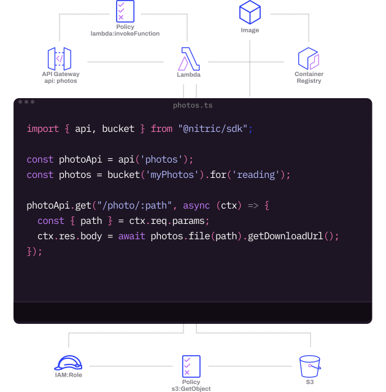

  

<h3 align="center">A cloud framework with infrastructure in code</h3>

  
  
  
  
  

## About Nitric

[Nitric](https://nitric.io) is a framework for rapid development of cloud-native and serverless applications. Define your apps in terms of the resources they need, then write the code for serverless function based APIs, event subscribers and scheduled jobs.

Apps built with Nitric can be deployed to AWS, Azure or Google Cloud all from the same code base so you can focus on your products, not your cloud provider.

Nitric makes it easy to architect cloud applications directly in application code, building scalable & secure applications with least priviledge security out of the box.

  

If you would like to know more about our future plans or what we are currently working on, you can look at the [Nitric Roadmap](https://github.com/orgs/nitrictech/projects/4).

## Documentation

The full documentation is available at [nitric.io/docs](https://nitric.io/docs).

The Nitric Framework is open source and encourages [code contributions](https://nitric.io/docs/contributions).

## Status

Nitric is currently in Public Preview. Anyone can use or deploy applications, but work remains and changes are likely. We’d love your feedback as we build additional functionality!

## Get in touch

- Ask questions in [GitHub discussions](https://github.com/nitrictech/nitric/discussions)

- Join us on [Discord](https://discord.gg/Webemece5C)

- Find us on [Twitter](https://twitter.com/nitric_io)

- Send us an [email](mailto:maintainers@nitric.io)
