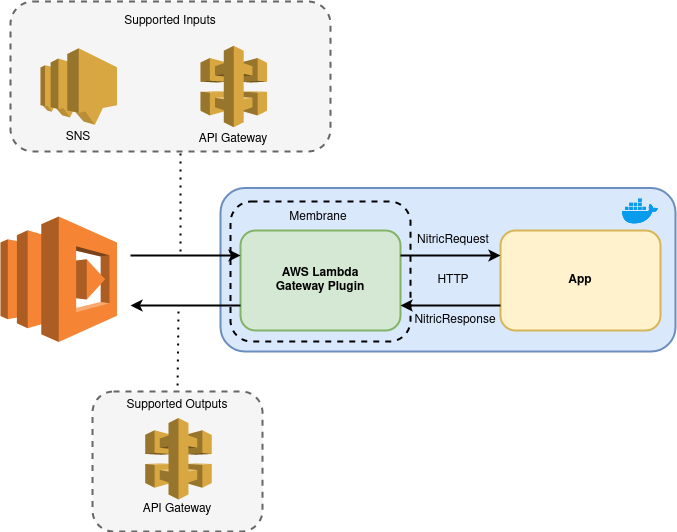

# AWS Lambda gateway plugin

The AWS Lambda gateway plugin leverages the AWS golang Lambda SDK to act as a bridge between the AWS lambda service and a Nitric Application.

Currently supported event types are:
 * API Gateway Events
 * SNS Events

  

