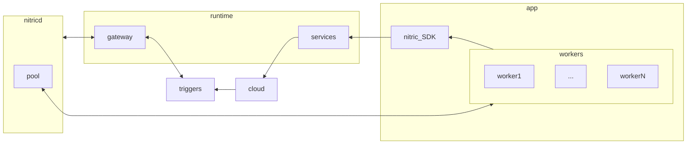

# Custom Runtimes

It is possible to develop completely custom runtimes with nitric. Nitric applications are still written entirely agnostic of the runtime and request resource requirements using cloud native primitives.

Developing a custom runtime allows the definition of what these primitives will look like in a concrete application deployment.

There are two key components required to build out a custom nitric cloud and these are the deployment and runtime components

## Deployment Component

The deployment component is responsible for provisioning your insfrastructure based on the requirements of a nitric application.

Cloud-native primitives that may require deployment are:

 - APIs (collection will provide Open API documents)
 - Topics & Subscriptions
 - Queues
 - Buckets
 - Collections

## Runtime Component

The runtime component is responsible for integrating your nitric application with the infrastructure provisioned by the the deployment component.

The includes the following:

 - Gateway (Data ingress/egress)
 - Pubsub
 - Queues
 - Storage
 - Collections

> Workers are managed by the nitric daemon `nitricd` to simplify the management of routing of triggers to workers. This process can be removed/replaced with a custom worker management implementation if necessary.

## Example Runtimes

