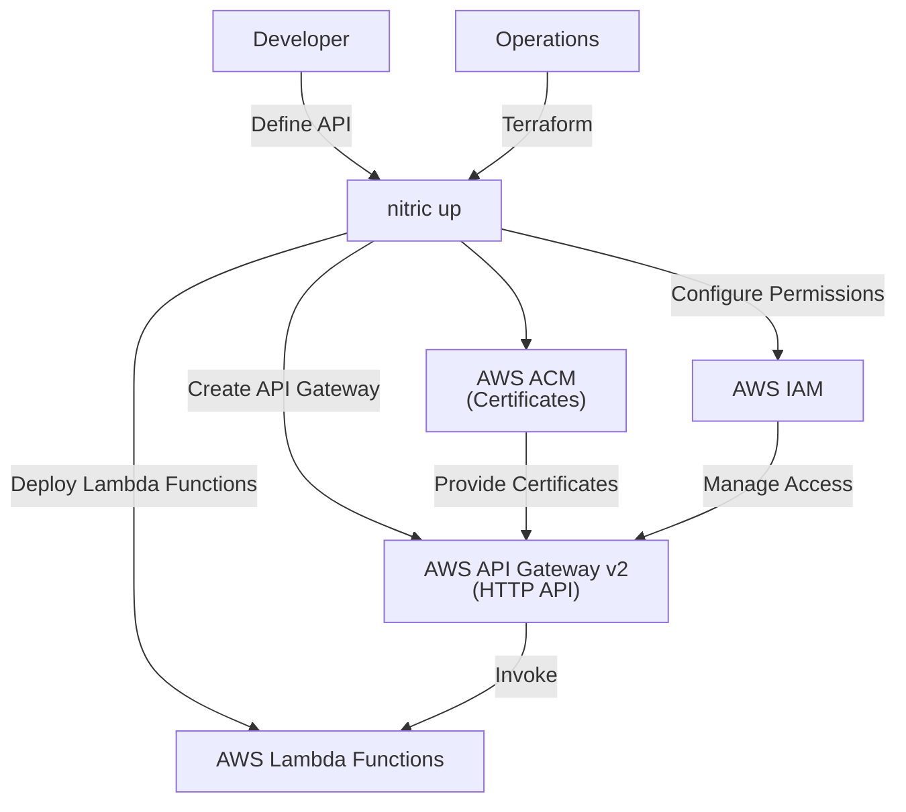
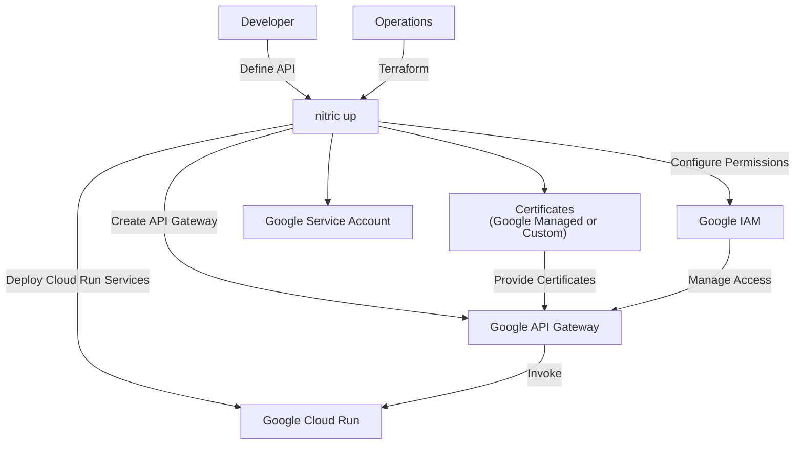
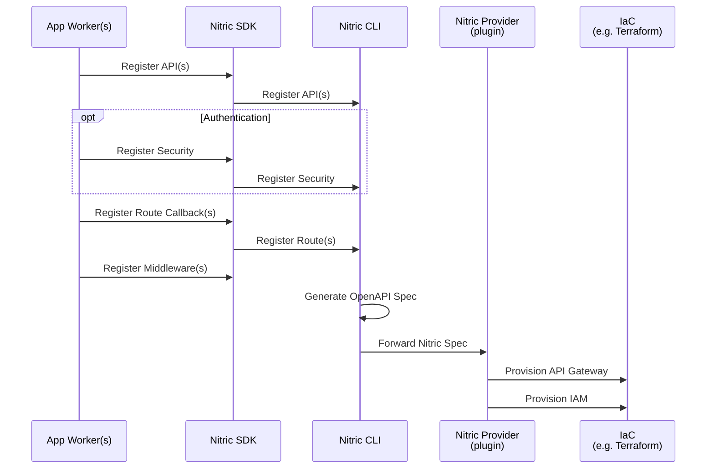
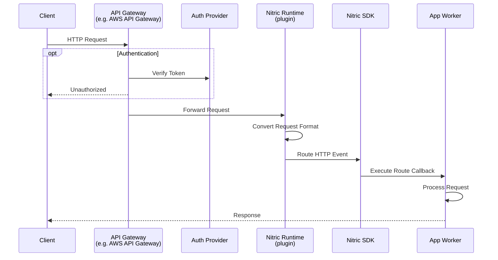

# APIs

## 1. System Context

**Developers** use Nitric to define required APIs and routes/methods within their application.

- App code uses the [API resource](/apis) to define APIs and their routes/methods.
- Developers define the API(s) their application requires, including the specifications and implement logic to handle HTTP requests.
- Authentication, authorization, and middleware can be added to API routes to secure and enhance functionality.

**Operations** use default or overridden IaC (e.g Terraform modules) to provision the necessary resources for their target cloud(s), such as API Gateways.

  
Example AWS Provider

- **AWS API Gateway v2** serves as the HTTP API management service.
- **AWS Lambda** functions are deployed to handle API requests.
- **AWS IAM** (automated using IaC) provides roles and policies for secure interaction between API Gateway and Lambda functions.
- **AWS ACM** manages TLS certificates for custom domain names.

  
Example GCP Provider

- **Google API Gateway** serves as the HTTP API management service, routing requests to backend services.
- **Google Cloud Run** services are deployed to handle API requests with serverless execution.
- **Google IAM** provides roles and policies to secure interactions between API Gateway, Cloud Run, and other GCP services.
- **Certificates** (Google-managed or custom) ensure secure HTTPS communication for custom domain names.
- **Google Service Account** is created and configured to allow API Gateway to invoke the Cloud Run backend securely.

## 2. Sequence

### Build Sequence

Here is the sequence of events that occur when a developer registers an API with Nitric, including the registration of routes, security, and middleware.

### Runtime Sequence

Here is the sequence of events that occur at runtime when a client makes an HTTP request to an API registered and deployed using Nitric.

## 3. Component

### API Module

- Dynamically creates and manages API gateways to expose application functionality through HTTP endpoints and routes.
- Configures API properties, including protocol type, API specifications (e.g., OpenAPI), and metadata for identification and lifecycle management.
- Provisions and associates backend integrations with API routes, supporting multiple targets such as serverless functions, containers, or application services.
- Automates the setup of custom domain names with secure certificates, abstracting provider-specific configurations for HTTPS communication.
- Grants least privilege permissions to enable secure communication between the API gateway and backend services, ensuring robust security practices.
- Supports versioning and staging of APIs, enabling seamless updates and rollbacks without disrupting existing deployments.
- Abstracts the complexities of cloud-native API gateway services, providing a unified interface for developing and deploying HTTP APIs across different providers.

## 4. Code

**Developers** write application code that uses the [API resource](/apis) from the SDK, defining the APIs routes, methods, middleware and auth.

SDK Reference by language:

- [NodeJS SDK](/reference/nodejs/api/api)
- [Python SDK](/reference/python/api/api)
- [Go SDK](/reference/go/api/api)
- [Dart SDK](/reference/dart/api/api)

**Operations** will use or extend the Nitric infrastructure modules, including both Terraform and Pulumi:

- Terraform Modules:
  - [AWS API Terraform Module](https://github.com/nitrictech/nitric/blob/main/cloud/aws/deploytf/.nitric/modules/api/main.tf)
  - [GCP API Terraform Module](https://github.com/nitrictech/nitric/blob/main/cloud/gcp/deploytf/.nitric/modules/api/main.tf)
- Pulumi Modules:
  - [AWS API Pulumi Module](https://github.com/nitrictech/nitric/blob/main/cloud/aws/deploy/api.go)
  - [GCP API Pulumi Module](https://github.com/nitrictech/nitric/blob/main/cloud/gcp/deploy/api.go)
  - [Azure API Pulumi Module](https://github.com/nitrictech/nitric/blob/main/cloud/azure/deploy/api.go)
