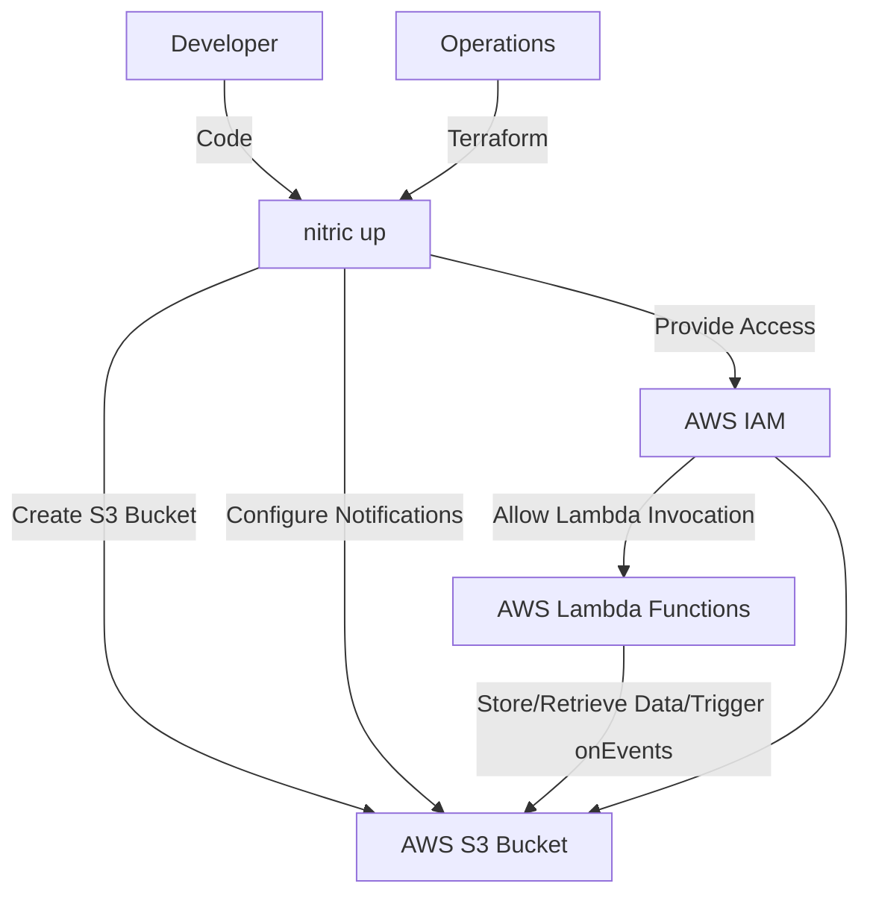
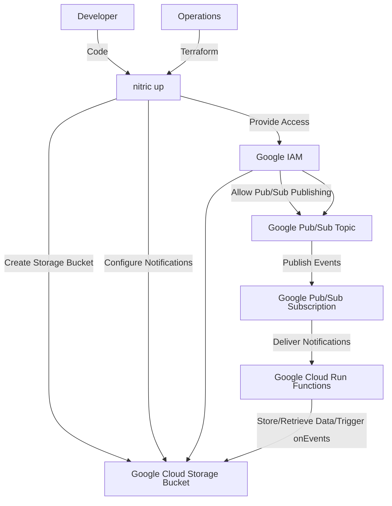
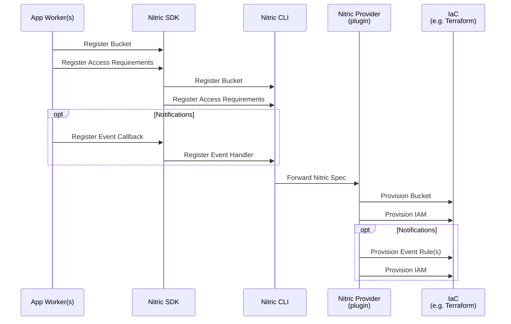
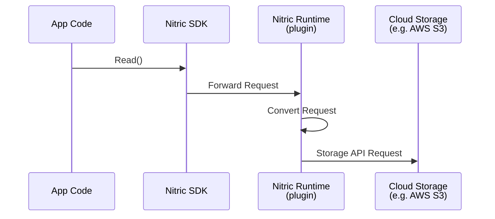

# Storage (Buckets/Object Storage)

## 1. System Context

**Developers** use Nitric to define required buckets within their application.

- App code uses the [Bucket resource](/storage) from the Nitric SDK.
- Developers define buckets their application requires and implement logic to securely store/retrieve/delete files.
- Developers _request_ the level of access they require for the bucket in their application logic e.g. read, write, delete.
- Developers can implement handlers for file change events such as write or delete.

**Operations** use default or overridden IaC (e.g Terraform modules) to provision the necessary resources for their target cloud.

  
Example AWS Provider

- **AWS S3** serves as the storage backend.
- **AWS Lambda** functions are used to process events triggered by S3.
- **AWS IAM** provides roles and policies for secure access to S3 buckets and Lambda functions, enforcing least privilege access based on the developers request.

  
Example GCP Provider

- **Google Cloud Storage** serves as the storage backend.
- **Google Cloud Pub/Sub** is used to publish events triggered by Cloud Storage notifications.
- **Google IAM** provides roles and policies for secure access to Cloud Storage buckets and Pub/Sub topics, enforcing least privilege access based on the developer's request.

## 2. Sequence

### Build Sequence

Below is the sequence of events that occur when a developer registers a bucket with Nitric. Including, optionally registering event handlers for file change events.

### Runtime Sequence

Below is the runtime flow of a storage operation in a Nitric application, using the Nitric SDK. The SDK forwards the request to the Nitric runtime, which converts the request and forwards it to the cloud storage API. The plugin nature of the Nitric runtime allows for seamless integration with different cloud providers.

## 3. Component

### Bucket Module

- Ensures storage buckets have unique names by appending a randomly generated identifier. This avoids naming conflicts and aligns with best practices for globally accessible cloud resources.
- Supports the addition of metadata tags for resource identification, management, and tracking, enabling better governance.
- Configures storage bucket notifications to trigger functions or message queues based on specified events (e.g., object update or deletion).
- Implements least privilege access by only assigning requested permissions to functions or services that interact with the storage bucket.
- Uses templates or dynamic blocks to handle multiple notification targets, allowing scalability and flexibility for different workflows.

## 4. Code

**Developers** write application code that uses the [Bucket resource](/storage) from the SDK, configures the bucket, and implements the application logic to read, write and delete files.

SDK Reference by language -

- [NodeJS SDK](/reference/nodejs/storage/bucket)
- [Python SDK](/reference/python/storage/bucket)
- [Go SDK](/reference/go/storage/bucket)
- [Dart SDK](/reference/dart/storage/bucket)

**Operations** will use or extend the Nitric infrastructure modules, including both Terraform and Pulumi:

- Terraform Modules:
  - [AWS Storage Bucket Terraform Module](https://github.com/nitrictech/nitric/blob/main/cloud/aws/deploytf/.nitric/modules/bucket/main.tf)
  - [GCP Storage Bucket Terraform Module](https://github.com/nitrictech/nitric/blob/main/cloud/gcp/deploytf/.nitric/modules/bucket/main.tf)
- Pulumi Modules:
  - [AWS Storage Bucket Pulumi Module](https://github.com/nitrictech/nitric/blob/main/cloud/aws/deploy/bucket.go)
  - [GCP Storage Bucket Pulumi Module](https://github.com/nitrictech/nitric/blob/main/cloud/gcp/deploy/bucket.go)
  - [Azure Storage Bucket Pulumi Module](https://github.com/nitrictech/nitric/blob/main/cloud/azure/deploy/bucket.go)
