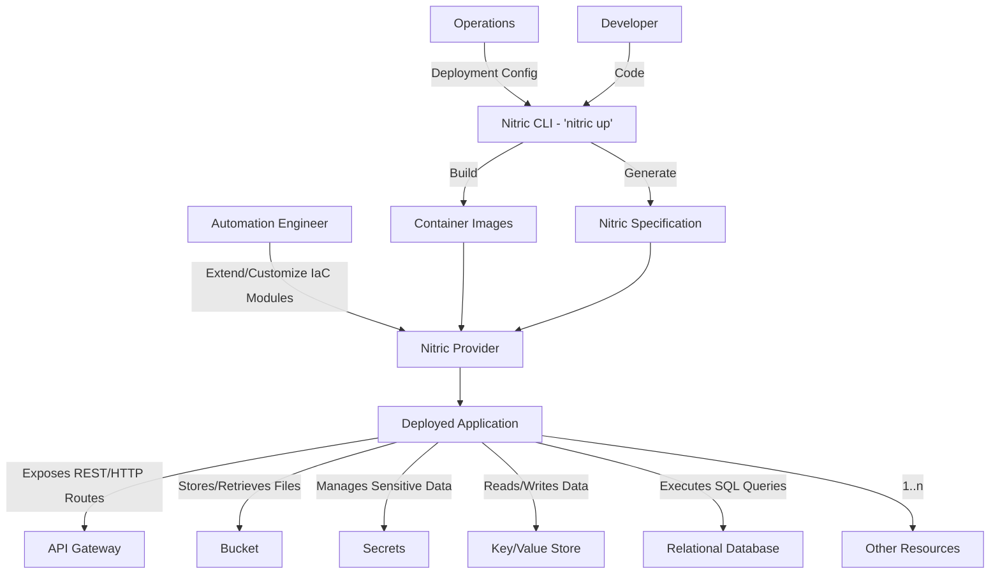
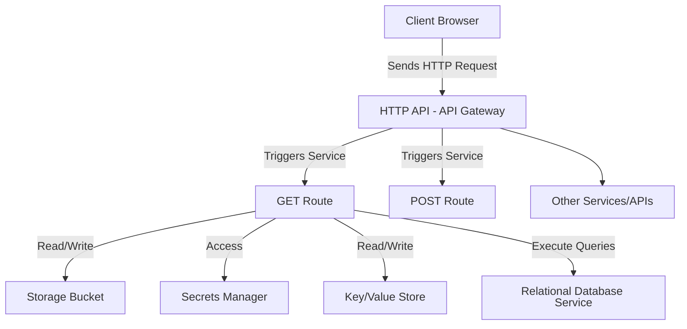
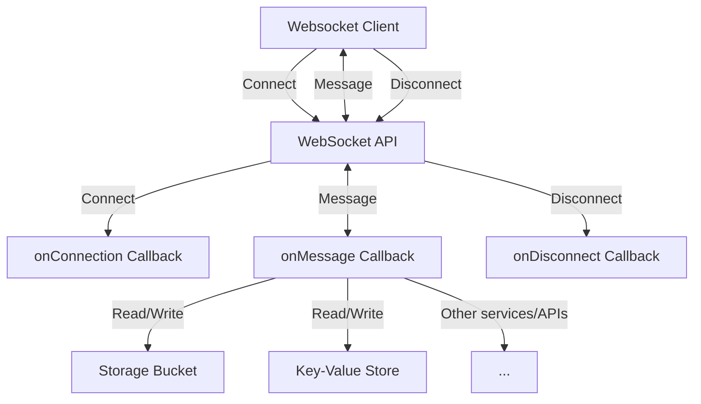
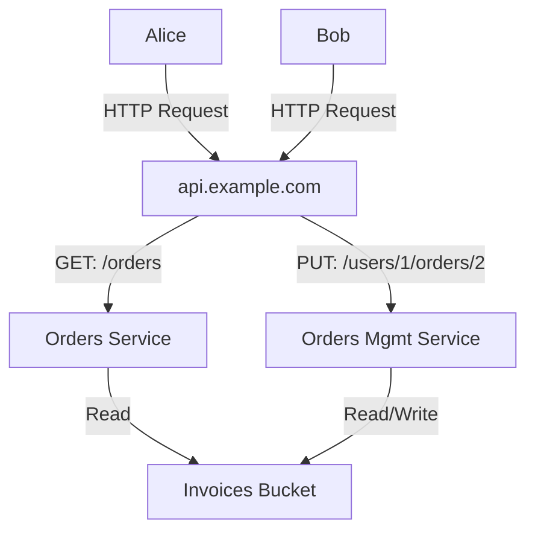
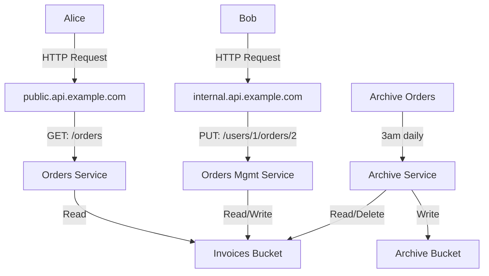

# Architecture Overview

Nitric allows your team to work together to build an application:

- **Developers**: Writes application code with built-in support for APIs, storage (bucket), secrets, key/value store, SQL databases and other cloud resources, leveraging the Nitric SDK.
- **Automation Engineers**: Customize, extend or use Nitric's generated IaC (Terraform or Pulumi) to provision and manage the resources needed to support applications.
- **Operations**: Configure environment/region/policy specific details, they also are heavily involved in overseeing that the Terraform, Pulumi or other IaC modules adhere to governance standards.

<Note>
  These roles are only representative, they often overlap or further divide
  depending on team structure. For example, it's not unusual in smaller teams
  for Developers to assume all roles, or for Automation and Operations to be
  handled by the same team.
</Note>

**Nitric** interacts with code to generate a specification of the resources required by each application. It then uses one or more IaC/cloud-specific plugins to turn those requirements into Infrastructure-as-Code (e.g. Terraform) or fully automate cloud deployments, which fully satisfy all of the applications infrastructure requirements. Effectively, Nitric is a cloud-agnostic way to define and deploy cloud applications, which automates the transition from code to cloud resources.

While many Nitric examples focus on AWS, Nitric's flexibility allows plugins (providers) to support any cloud or on-prem environment, even multiple clouds simultaneously if that's required.

Nitric applications can have any number of APIs, Secrets, Buckets etc. Providers can also be extended to further support new resources, many of which will work across all cloud providers and some that are cloud specific.

Interact seamlessly with services exposed through HTTP routes in an API gateway, as scheduled tasks, via event subscriptions, through WebSocket handlers, and more.

## Example: Handling HTTP requests

- The **Client Browser** sends an HTTP request to the **API Gateway**.
- The **API Gateway** acts as a proxy, forwarding the request to the appropriate **Services**.
- The **Services** process the request by coordinating with different resources like buckets, secrets, key/value store etc.

## Example: Handling Websockets

- The **Client** opens a WebSocket connection.
- The **WebSocket API** handles the connection lifecycle:
  - When the connection opens, it triggers the **onConnect** callback function.
  - Once the connection is established, messages from the client trigger the **onMessage** callback function.
  - When the connection closes, it triggers the **onDisconnect** callback function.
- The **onMessage**, **onConnect** and **onDisconnect** callbacks:
  - Are contained within one or more Services, accepting events from the WebSocket API.
  - Interact with other cloud resources e.g. Buckets, KeyValue stores and APIs.

## Example: Sharing resources

Deploy multiple services, behind shared API Gateways and interact with other shared resources.

- **Client Browsers** send HTTP requests to a shared **API Gateway**, which routes requests to the appropriate service.
- The **API Gateway's** respective route handlers (services) are established with least privileges:
  - The `Orders Service`, can be restricted to read-only permissions to the Invoices Bucket.
  - The `Orders Management Service`, is instead granted both read and write permissions to the Invoices Bucket.

## Example: Multiple entry points

A Nitric application can also have multiple entry points, such as multiple **HTTP API Gateways** and a **Schedule**, all sharing specific common resources.

- **Client Browsers** send HTTP requests to different **API Gateways**, which route requests to the appropriate service.
- The **API Gateway's** respective route handlers (services) are established with least privileges:
  - The `Orders Service`, can be restricted to read-only permissions to the Invoices Bucket.
  - The `Orders Management Service`, is instead granted both read and write permissions to the Invoices Bucket.
- A **Schedule** triggers the `Archive Service` to read and delete from the Invoices Bucket and write to the Archive Bucket.
