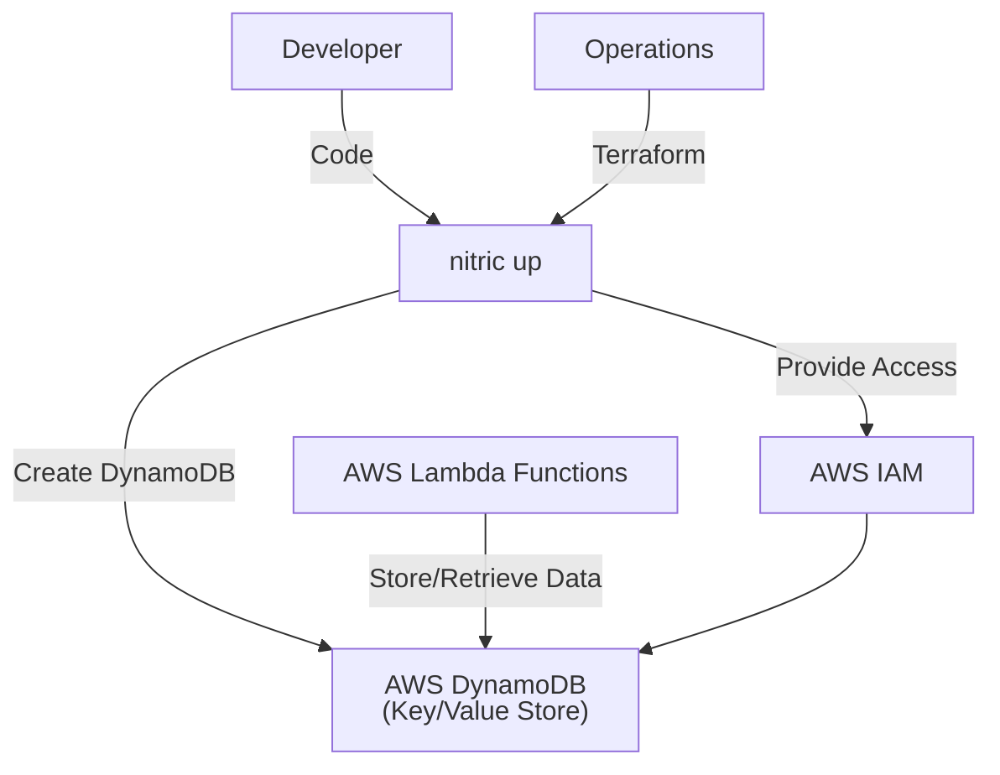
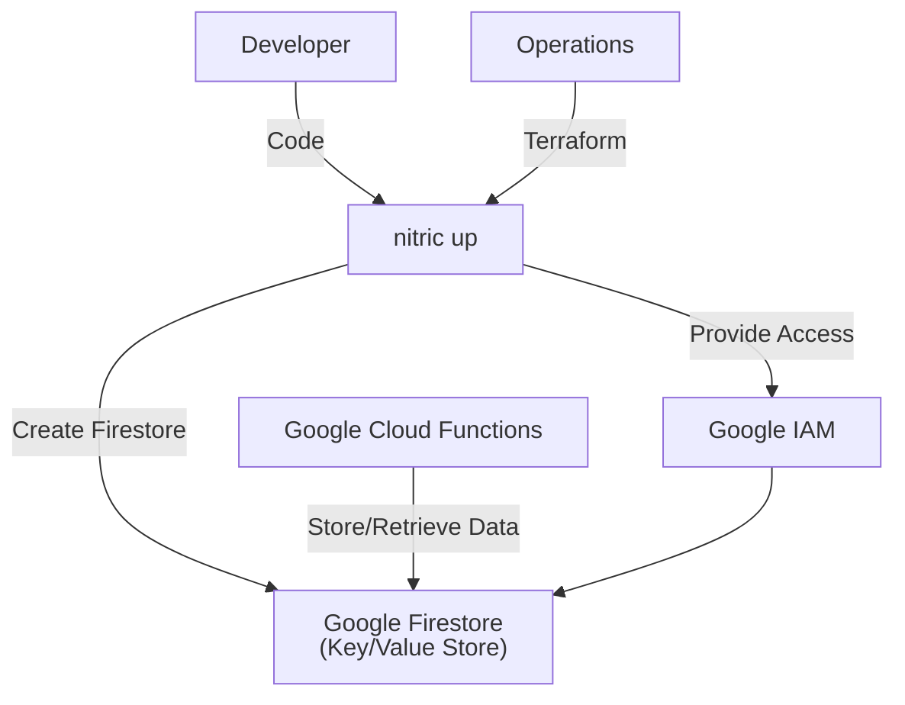
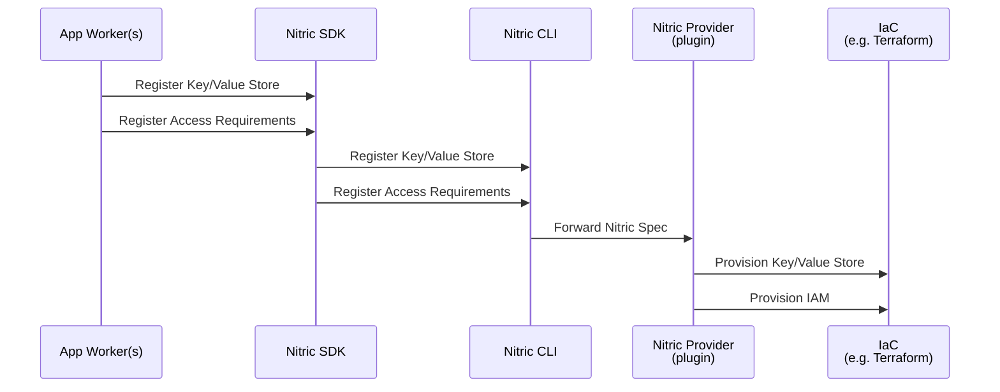
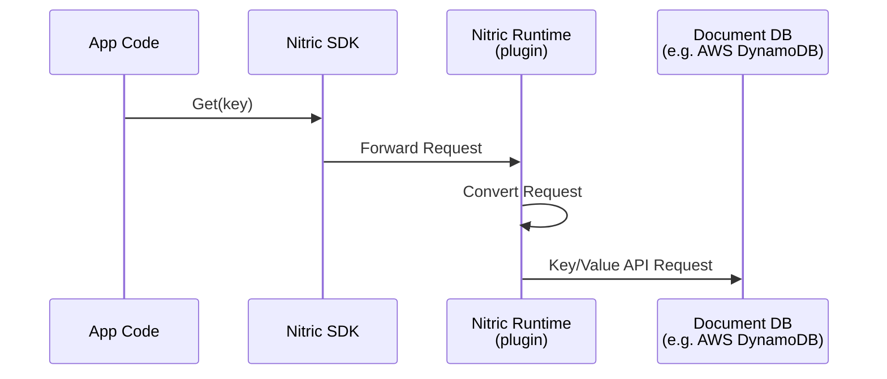

# Key/Value Stores

## 1. System Context

**Developers** use Nitric to define required key/value stores within their application.

- App code uses the [Key/Value resource](/keyvalue) from the Nitric SDK.
- Developers define key/value stores their application requires and implement logic to securely read/write/delete values with unique keys.

**Operations** use default or overridden IaC (e.g Terraform modules) to provision the necessary resources for their target cloud.

  
Example AWS Provider

- **AWS DynamoDB** serves as the key/value store backend.
- **AWS IAM** provides roles and policies for secure access to DynamoDB tables.

  
Example GCP Provider

- **Google Firestore** serves as the key/value store backend.
- **Google IAM** provides roles and policies for secure access to Firestore.

## 2. Sequence

### Build Sequence

Below is a sequence diagram showing the sequence of events when a developer registers a Key/Value store with Nitric.

### Runtime Sequence

Below is a sequence diagram showing the runtime flow of a key/value store operation using Nitric. The example shows a Get operation, which reads a value by its key.

## 3. Component

### Key/Value Store Module

- Ensures unique identification of key-value stores by using a standardized naming convention or randomly generated identifiers.
- Supports the definition of attributes, partition keys, and optional sort keys to optimize data organization and querying.
- Provides scalable and cost-efficient storage configurations suitable for variable workloads.
- Enables dynamic access control by assigning permissions to applications or services based on predefined roles and policies, ensuring least privilege access.
- Offers support for event-driven workflows, allowing integration with notification systems or functions triggered by changes in the store.
- Abstracts the underlying key-value storage implementation, enabling consistent developer and operations experience across different cloud providers.

## 4. Code

**Developers** write application code that uses the [Key/Value resource](/keyvalue) from the SDK, configures the secret, and implements the application logic to access and manage secrets.

SDK Reference by language -

- [NodeJS SDK](/reference/nodejs/keyvalue/keyvalue)
- [Python SDK](/reference/python/keyvalue/keyvalue)
- [Go SDK](/reference/go/keyvalue/keyvalue)
- [Dart SDK](/reference/dart/keyvalue/keyvalue)

**Operations** will use or extend the Nitric infrastructure modules, including both Terraform and Pulumi:

- Terraform modules:
  - [AWS Key/Value Store Terraform Module](https://github.com/nitrictech/nitric/blob/main/cloud/aws/deploytf/.nitric/modules/keyvalue/main.tf)
  - [GCP Key/Value Store Terraform Module](https://github.com/nitrictech/nitric/blob/main/cloud/gcp/deploytf/.nitric/modules/keyvalue)
    - KeyValue stores are created at runtime in GCP, so no Terraform module is required.
- Pulumi modules:
  - [AWS Key/Value Store Pulumi Module](https://github.com/nitrictech/nitric/blob/main/cloud/aws/deploy/keyvalue.go)
  - [GCP Key/Value Store Pulumi Module](https://github.com/nitrictech/nitric/blob/main/cloud/gcp/deploy/keyvalue.go)
    - KeyValue stores are created at runtime in GCP, so no Pulumi module is required.
  - [Azure Key/Value Store Pulumi Module](https://github.com/nitrictech/nitric/blob/main/cloud/azure/deploy/keyvalue.go)
