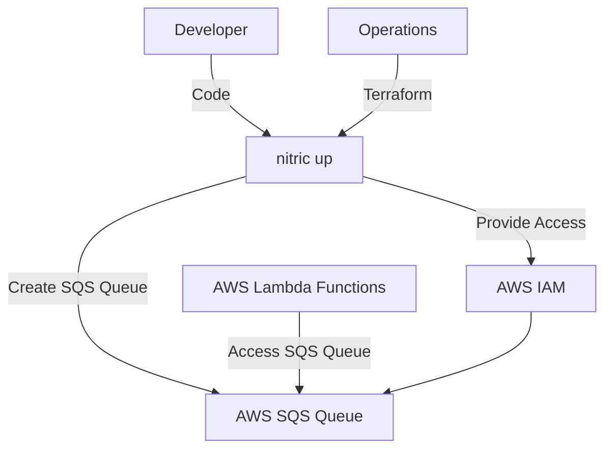
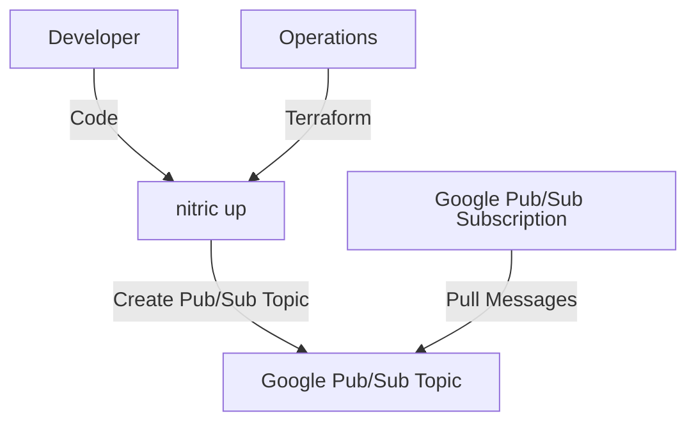
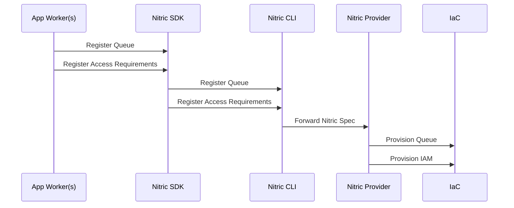
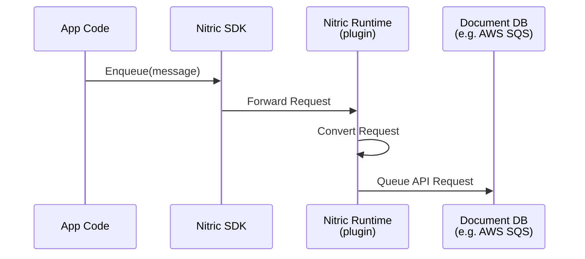

# Messaging - Queues

## 1. System Context

**Developers** use Nitric to define required message queues within their application.

- App code uses the [Queue resource](/messaging#queues) from the Nitric SDK.
- Developers define queues their application requires and implement application logic to send or receive messages.

**Operations** use default or overridden IaC (e.g Terraform modules) to provision the necessary resources for their target cloud.

  
Example AWS Provider

- **AWS SQS** serves as the message queuing service.
- **AWS IAM** provides roles and policies for secure access to SQS queues.

  
Example GCP Provider

- **Google Pub/Sub Topic** serves as the message queuing service.
- **Google Pub/Sub Subscription** emulates a queue by creating a pull subscription for the topic.

## 2. Sequence

### Build Sequence

Below is a sequence diagram showing the sequence of events when a developer registers a Queue with Nitric. This is the process that occurs when using the `nitric up` command.

### Runtime Sequence

Below is the runtime flow when performing operations on a Queue using Nitric, such as enqueueing or dequeueing messages. The example shows an Enqueue operation, which sends a message to the queue.

## 3. Component

### Queue Module

- Ensures the deployment of a scalable, provider-agnostic message queue with a consistent naming convention for seamless integration.
- Configures metadata or tags for resource identification, governance, and management.
- Implements secure access by dynamically assigning permissions to applications or services, enforcing the principle of least privilege.
- Supports configurable event-driven workflows, enabling the integration of producer-consumer patterns and worker pipelines.
- Provides dynamic configurations to handle varying workloads and queue-specific parameters such as message retention, delivery delay, and dead-letter queues.
- Abstracts the underlying queuing infrastructure, allowing developers and operations teams to focus on messaging logic rather than provider-specific APIs.

## 4. Code

**Developers** write application code that uses the [Queue resource](/messaging#queues) from the SDK, configures the secret, and implements the application logic to access and manage secrets.

SDK Reference by language -

- [NodeJS SDK](/reference/nodejs/queues/queue)
- [Python SDK](/reference/python/queues/queue)
- [Go SDK](/reference/go/queues/queue)
- [Dart SDK](/reference/dart/queues/queue)

**Operations** will use or extend the Nitric infrastructure modules, including both Terraform and Pulumi:

- Terraform modules:
  - [AWS Queue Terraform Module](https://github.com/nitrictech/nitric/blob/main/cloud/aws/deploytf/.nitric/modules/queue/main.tf)
  - [GCP Queue Terraform Module](https://github.com/nitrictech/nitric/blob/main/cloud/gcp/deploytf/.nitric/modules/queue/main.tf)
- Pulumi modules:
  - [AWS Queue Pulumi Module](https://github.com/nitrictech/nitric/blob/main/cloud/aws/deploy/queue.go)
  - [GCP Queue Pulumi Module](https://github.com/nitrictech/nitric/blob/main/cloud/gcp/deploy/queue.go)
  - [Azure Queue Pulumi Module](https://github.com/nitrictech/nitric/blob/main/cloud/azure/deploy/queue.go)
