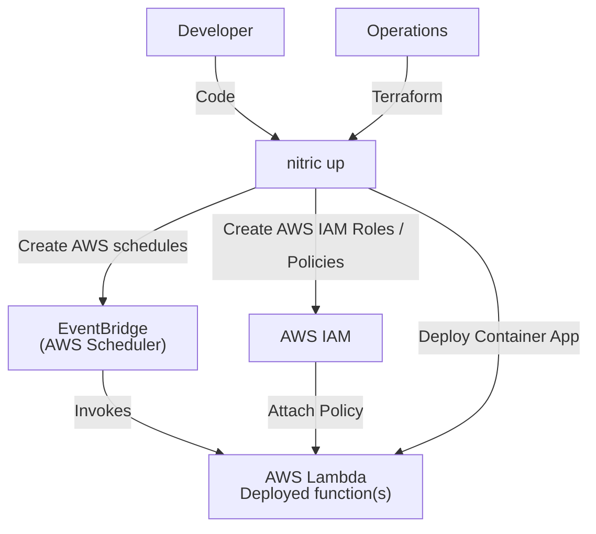
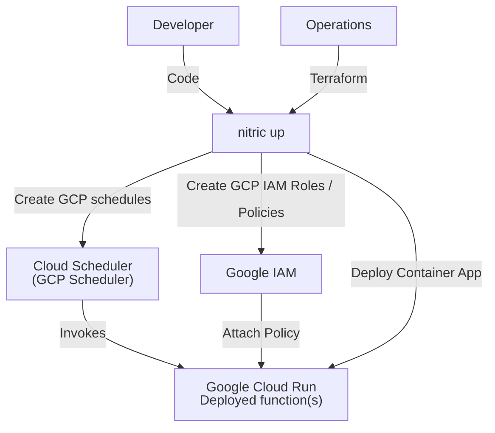
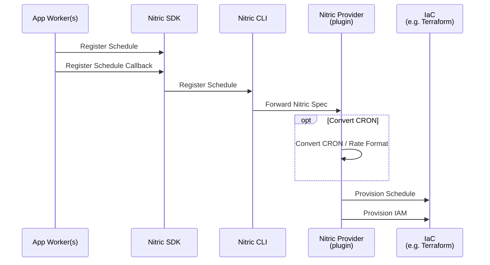
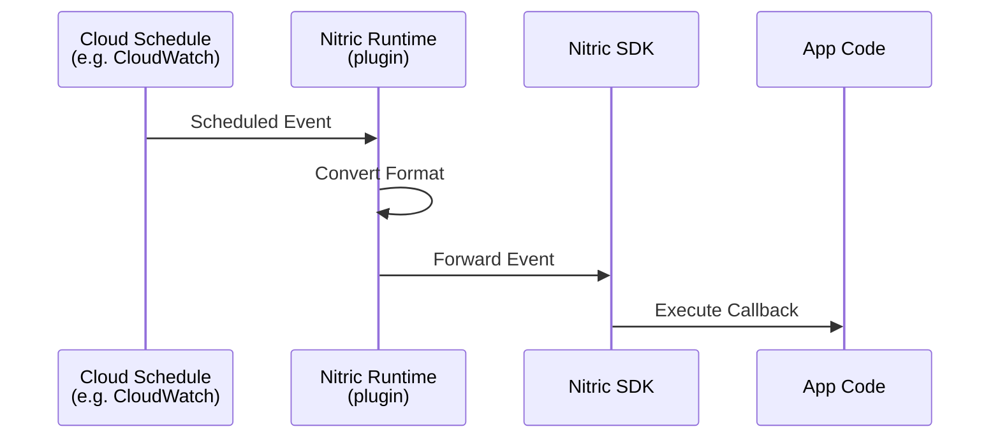

# Schedules

## 1. System Context

**Developers** use Nitric to defined scheduled tasks within their application.

- App code uses the [Schedule resource](/schedules) from the Nitric SDK.
- Developers configure the schedule with CRON or rate expressions like '7 days' and implement application logic to be executed when triggered.

**Operations** use default/extended or overridden Terraform modules to provision the necessary resources to run the app logic on the defined schedule.

  
Example AWS Provider

- **Lambda function** is deployed as a packaged container image uploaded to an Amazon Elastic Container Registry (Amazon ECR).
- **AWS EventBridge** is used to schedule and trigger Lambda functions.
- **AWS IAM** provides the role/policies allowing EventBridge to invoke the Lambda functions securely.

  
Example GCP Provider

- **Google Cloud Run** is deployed as a container image stored in **Google Artifact Registry (GCR)**.
- **Google Cloud Scheduler** is used to schedule and trigger **Google Cloud Run** functions via an HTTP trigger.
- **Google IAM** provides the role/policies allowing **Cloud Scheduler** to invoke the **Cloud Run** service securely.

## 2. Sequence

Below is the sequence of events that occur when a developer registers a schedule and a callback function with Nitric.

### Runtime Sequence

Below is the runtime flow of a schedule service triggering a Nitric service and executing the application logic in the schedule callback.

## 3. Component

### Schedule Module

- Dynamically creates the necessary roles and permissions for the scheduling service to securely trigger application tasks, enforcing the principle of least privilege.
- Configures the scheduling system with CRON or rate expressions and supports additional parameters like time zones for flexibility.
- Automatically attaches policies to allow secure invocation of application functions or services when schedules are triggered.
- Supports passing custom event payloads to tasks, enabling dynamic behavior and workflows.
- Abstracts the underlying scheduler implementations, allowing developers and operations teams to interact with a unified scheduling interface without concerning themselves with provider-specific configurations.
- Enables seamless integration of recurring or scheduled tasks into applications without manual setup of complex cloud-native scheduling systems.

## 4. Code

**Developers** write application code like the following examples that uses the [Schedule resource](/schedules) from the SDK, configure the schedule and implement the application code that will execute.

SDK Reference by language -

- [NodeJS SDK](/reference/nodejs/schedule/schedule)
- [Python SDK](/reference/python/schedule/schedule)
- [Go SDK](/reference/go/schedule/schedule)
- [Dart SDK](/reference/dart/schedule/schedule)

**Operations** will use or extend the Nitric infrastructure modules, including both Terraform and Pulumi:

- Terraform Modules:
  - [AWS Schedule Terraform Module](https://github.com/nitrictech/nitric/blob/main/cloud/aws/deploytf/.nitric/modules/schedule/main.tf)
  - [GCP Schedule Terraform Module](https://github.com/nitrictech/nitric/blob/main/cloud/gcp/deploytf/.nitric/modules/schedule/main.tf)
- Pulumi Modules:
  - [AWS Schedule Pulumi Module](https://github.com/nitrictech/nitric/blob/main/cloud/aws/deploy/schedule.go)
  - [GCP Schedule Pulumi Module](https://github.com/nitrictech/nitric/blob/main/cloud/gcp/deploy/schedule.go)
  - [Azure Schedule Pulumi Module](https://github.com/nitrictech/nitric/blob/main/cloud/azure/deploy/schedule.go)
