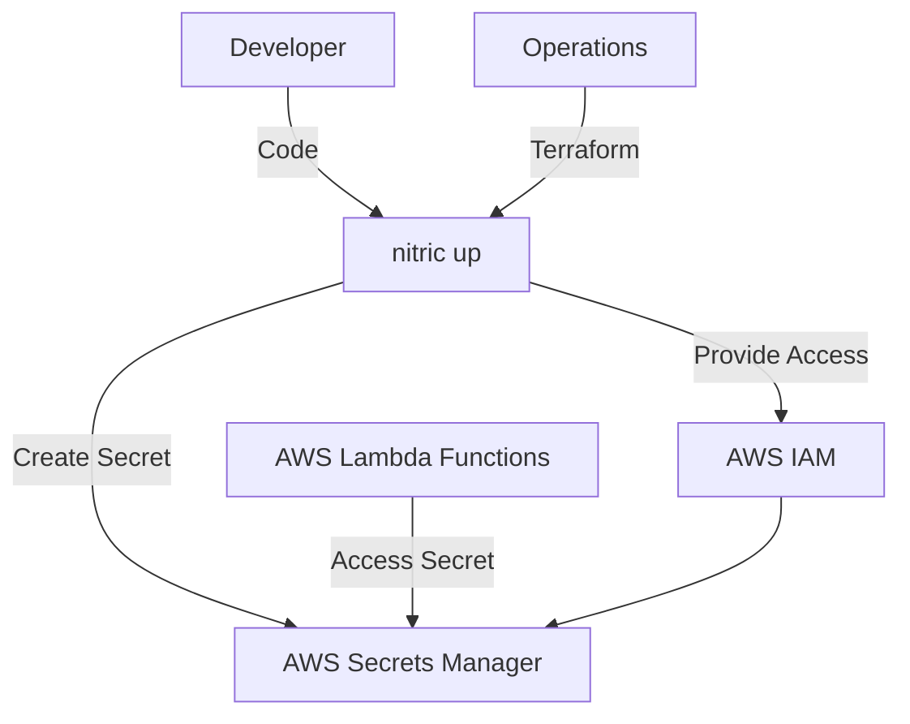
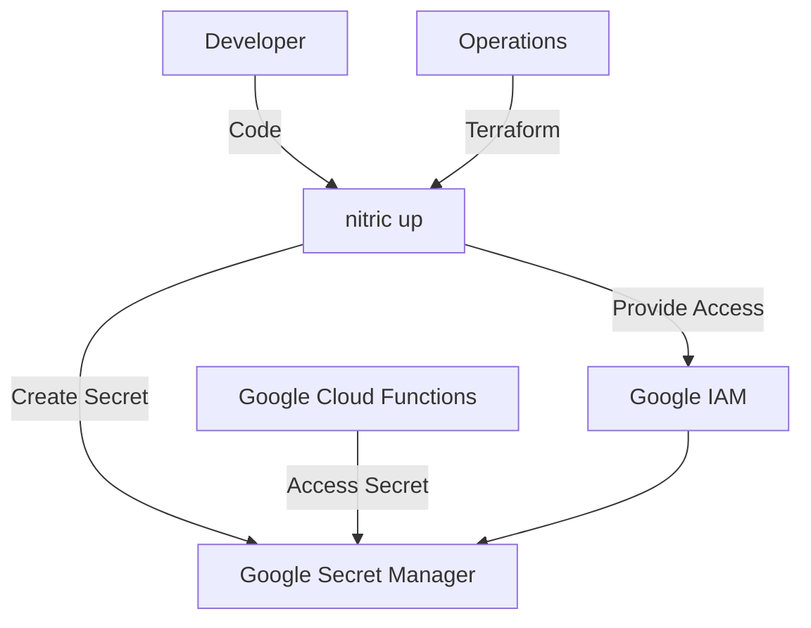
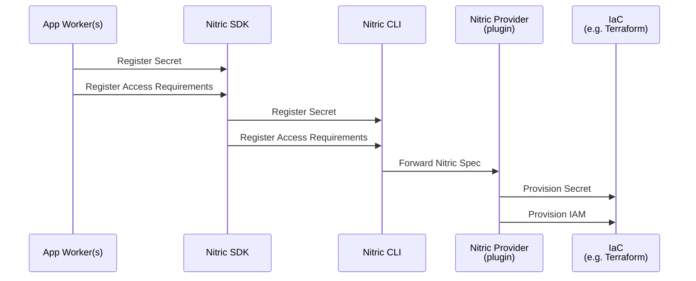
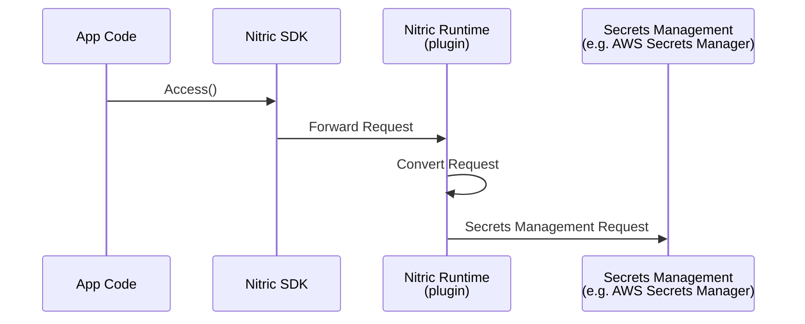

# Secrets

## 1. System Context

**Developers** use Nitric to define required secrets within their application.

- App code uses the [Secrets resource](/secrets) from the Nitric SDK.
- Developers define secrets their application requires and implement logic to securely access and/or update secret values.

**Operations** use default or overridden IaC (e.g Terraform modules) to provision the necessary resources for their target cloud.

  
Example AWS Provider

- **AWS Secrets Manager** stores and manages secrets.
- **AWS IAM** provides roles/policies for secure access to secrets.

  
Example GCP Provider

- **Google Secret Manager** stores and manages secrets.
- **Google IAM** provides roles/policies for secure access to secrets.

## 2. Sequence

### Build Sequence

Below is the sequence of events that occur when a developer registers a secret with Nitric. This includes defining the secret and its access requirements, which are then provisioned by the Nitric provider using IaC.

### Runtime Sequence

Below is a sequence diagram showing the runtime flow of a secret operation in a Nitric application, using the Nitric SDK. The SDK forwards the request to the Nitric runtime, which converts the request and forwards it to the cloud secrets management API. The plugin nature of the Nitric runtime allows for seamless integration with different cloud providers.

## 3. Component

### Secrets Module

- Dynamically creates and manages secure storage for sensitive information, ensuring confidentiality and integrity.
- Configures secrets with appropriate metadata or tags for easy identification, tracking, and management.
- Enforces access control policies to restrict secret usage to authorized applications or services, following the principle of least privilege.
- Supports versioning of secrets to facilitate secure updates and rollback capabilities without service disruption.
- Provides seamless integration with application workflows by enabling dynamic retrieval and management of secrets.
- Abstracts the complexity of underlying secret management systems, allowing developers and operators to interact with a unified interface regardless of the cloud provider.

## 4. Code

**Developers** write application code that imports the 'secret' resource from the SDK, configures the secret, and implements the application logic to access and manage secrets.

SDK Reference by language -

- [NodeJS SDK](/reference/nodejs/secrets/secret)
- [Python SDK](/reference/python/secrets/secret)
- [Go SDK](/reference/go/secrets/secret)
- [Dart SDK](/reference/dart/secrets/secret)

**Operations** will use or extend the Nitric infrastructure modules, including both Terraform and Pulumi:

- Terraform modules:
  - [AWS Secret Terraform Module](https://github.com/nitrictech/nitric/blob/main/cloud/aws/deploytf/.nitric/modules/secret/main.tf)
  - [GCP Secret Terraform Module](https://github.com/nitrictech/nitric/blob/main/cloud/gcp/deploytf/.nitric/modules/secret/main.tf)
- Pulumi modules:
  - [AWS Secret Pulumi Module](https://github.com/nitrictech/nitric/blob/main/cloud/aws/deploy/secret.go)
  - [GCP Secret Pulumi Module](https://github.com/nitrictech/nitric/blob/main/cloud/gcp/deploy/secret.go)
  - [Azure Secret Pulumi Module](https://github.com/nitrictech/nitric/blob/main/cloud/azure/deploy/secret.go)
    - A stack level Azure Key Vault is created during deployment. The secrets are created at runtime, so no Pulumi module is required.
