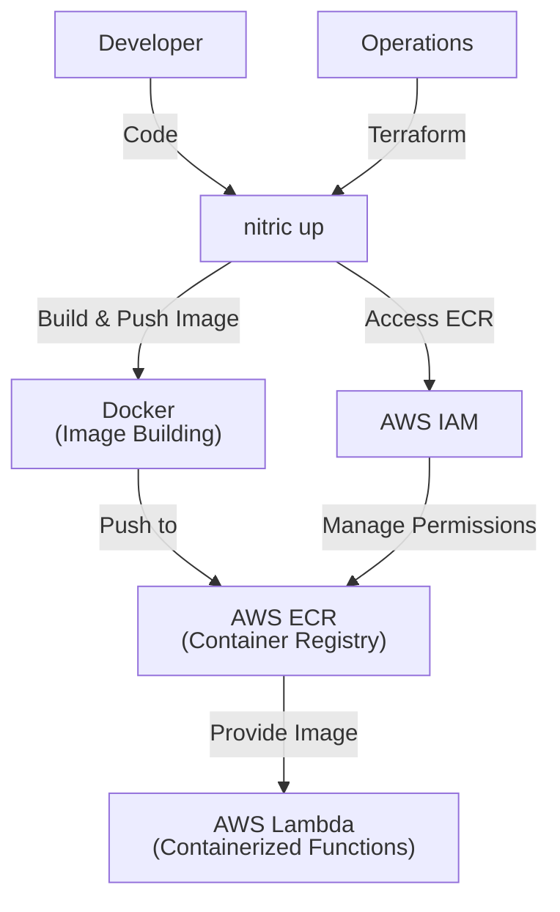
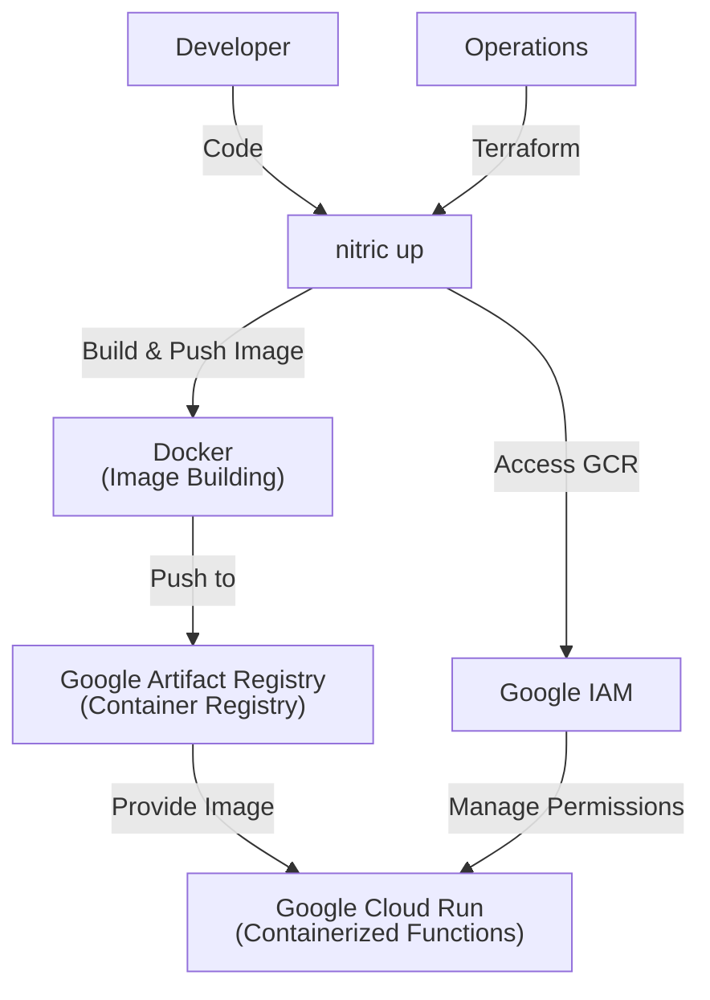
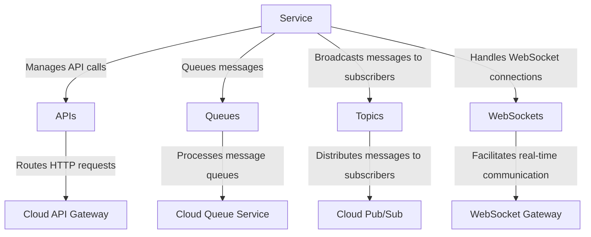
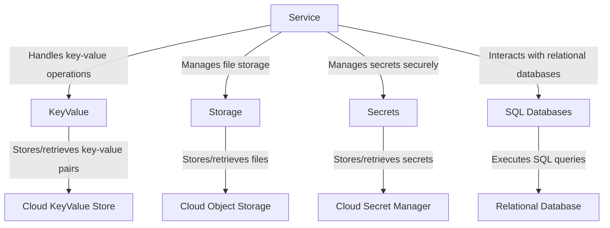
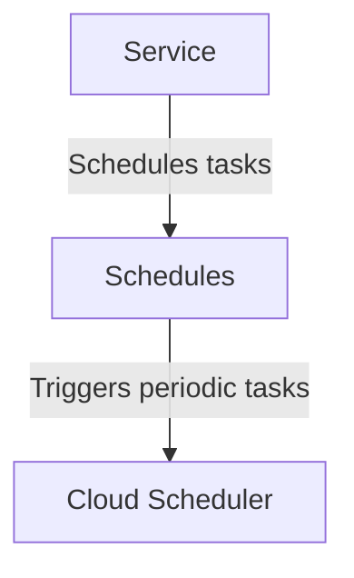

In Nitric a **service** is a deployable unit of code, typically this is a single container image, that can be deployed to a cloud provider. Services can be deployed as serverless functions, long-running containers or potentially on VMs or other compute resources. All of Nitric's standard deployment providers deploy services as containers on serverless platforms by default.

In many way services are the core building block of Nitric applications, they are the unit of code that is deployed and run in the cloud. Services can be written in any language that can be compiled to a container image, and can be deployed to any cloud provider that Nitric supports. They're responsible for handling API requests, processing messages, and executing tasks, among other things. Most other resources in Nitric are designed to be declared by services, or interact with them in some way.

An application can have a single service handling the entire application, or many services working together to provide a more complex application. Services can be written in different languages, even within the same application.

# Service Deployment

## 1. System Context

**Developers** use Nitric to create services or functions within their application.

- Application code is written in files that matches the pattern(s) in the nitric.yaml config file.
- The **Nitric CLI** builds container images for their Lambda functions and push them to a container registry.

**Operations** use default or overridden IaC (e.g Terraform modules) to provision the necessary resources for their target cloud.

<details>
  <summary>Example AWS Provider</summary>

- **AWS ECR (Elastic Container Registry)** stores a container image for each Nitric service.
- **AWS Lambda** runs containers based on the images from ECR.
- **AWS IAM** manages roles and policies for secure access to AWS resources.
- **Docker** or **Podman** is used to build and tag container images before pushing them to ECR.



</details>
<details>
  <summary>Example GCP Provider</summary>

- **Docker** builds and tags the image, which is then pushed to **Google Artifact Registry (GCR)**.
- **Google IAM** ensures secure access, with the appropriate permissions for the Cloud Run service and service accounts.
- The **Cloud Run** service will run based on the container image pulled from **GCR**.



</details>

## 2. Container

General-purpose workers that handle tasks like processing queues, topics, or schedules. Services abstract the runtime’s ability to route tasks and events to application-defined logic.

### API & Event-Driven Communication



### Data Storage & Management



### Task Execution & Scheduling



## 3. Component

### Service Module

- Configures Terraform to handle the deployment and management of containerized services, abstracting away provider-specific details.
- Dynamically creates and manages a container registry for storing service container images, ensuring secure and efficient access.
- Automates authentication and tagging for container image pushes, supporting seamless integration with deployment pipelines.
- Creates a role with least privilege permissions for executing the service, including necessary trust relationships and policies for interacting with other resources.
- Configures containerized services with runtime parameters like environment variables, memory limits, and execution timeouts to optimize performance and scalability.
- Optionally supports advanced networking configurations like VPC settings for secure and isolated deployments.
- Abstracts the underlying infrastructure for running serverless or containerized services, enabling developers to focus on application logic while providing a consistent interface for operations teams.

## 4. Code

**Developers** write application code that implements handlers for the [api](/apis), [storage](/storage), [websocket](/websockets), [topic](/messaging#topics), [schedule](/schedules) resources. This code is written in files that matches the pattern(s) in the nitric.yaml file.

### Nitric service configuration - nitric.yaml

<CodeTabs>

<TabItem label="JavaScript">

```yaml
name: service-name
services:
  - match: ./services/*.js
    start: npm run dev:services $SERVICE_PATH
    runtime: node
runtimes:
  node:
    dockerfile: ./node.dockerfile
    args: {}
```

</TabItem>

<TabItem label="TypeScript">

```yaml
name: service-name
services:
  - match: services/*.ts
    start: npm run dev:services $SERVICE_PATH
    runtime: node
runtimes:
  node:
    dockerfile: ./node.dockerfile
    args: {}
```

</TabItem>

<TabItem label="Python">

```yaml
name: service-name
services:
  - match: services/*.py
    start: uv run watchmedo auto-restart -p *.py --no-restart-on-command-exit -R uv run $SERVICE_PATH
    runtime: python
batch-services: []
runtimes:
  python:
    dockerfile: ./python.dockerfile
    context: ''
    args: {}
```

</TabItem>

<TabItem label="Go">

```yaml
name: service-name
services:
  - match: services/*
    start: go run ./$SERVICE_PATH/...
    runtime: go
runtimes:
  go:
    dockerfile: ./golang.dockerfile
    args: {}
```

</TabItem>

<TabItem label="Dart">

```yaml
name: service-name
services:
  - match: services/*.dart
    start: dart run --observe $SERVICE_PATH
    runtime: dart
runtimes:
  dart:
    dockerfile: ./dart.dockerfile
    args: {}
```

</TabItem>

</CodeTabs>

### HTTP Route Handler

<CodeSwitcher tabs>

```javascript !!
import { api } from '@nitric/sdk'

const customerRoute = api('public').route(`/customers`)

customerRoute.get((ctx) => {
  // construct response for the GET: /customers request...
  const responseBody = {}
  ctx.res.json(responseBody)
})
```

```typescript !!
import { api } from '@nitric/sdk'

const customerRoute = api('public').route(`/customers`)

customerRoute.get((ctx) => {
  // construct response for the GET: /customers request...
  const responseBody = {}
  ctx.res.json(responseBody)
})
```

```python !!
from nitric.resources import api
from nitric.application import Nitric

customer_route = api("public").route("/customers")

@customer_route.get()
async def get_customers(ctx):
    # construct response for the GET: /customers request...
    response_body = {}
    return ctx.json(response_body)

Nitric.run()
```

```go !!
package main

import (
	"github.com/nitrictech/go-sdk/nitric"
	"github.com/nitrictech/go-sdk/nitric/apis"
)

func main() {
	customersRoute := nitric.NewApi("public").NewRoute("/customers")

	customersRoute.Get(func(ctx *apis.Ctx) {
		ctx.Response.Body = []byte("Hello World")
	})

	nitric.Run()
}
```

```dart !!
import 'package:nitric_sdk/nitric.dart';

void main() {
  final customersRoute = Nitric.api("public").route("/customers");

  customersRoute.get((ctx) async {
    // construct response for the GET: /customers request...
    final Map<String, dynamic> responseBody = {};
    ctx.res.json(responseBody);

    return ctx;
  });
}
```

</CodeSwitcher>

### Bucket On Read/Write/Delete Handler

<CodeSwitcher tabs>

```javascript !!
import { bucket } from '@nitric/sdk'

const assets = bucket('assets')

const accessibleAssets = bucket('assets').allow('delete')

// The request will contain the name of the file `key` and the type of event `type`
assets.on('delete', '*', (ctx) => {
  console.log(`A file named ${ctx.req.key} was deleted`)
})
```

```typescript !!
import { bucket } from '@nitric/sdk'

const assets = bucket('assets')

const accessibleAssets = bucket('assets').allow('delete')

// The request will contain the name of the file `key` and the type of event `type`
assets.on('delete', '*', (ctx) => {
  console.log(`A file named ${ctx.req.key} was deleted`)
})
```

```python !!
from nitric.resources import bucket
from nitric.application import Nitric

assets = bucket("assets")

accessible_assets = bucket("assets").allow("delete")

@assets.on("delete", "*")
async def delete_asset(ctx):
    print(f"A file named {ctx.req.key} was deleted")

Nitric.run()
```

```go !!
package main

import (
	"fmt"

	"github.com/nitrictech/go-sdk/nitric"
	"github.com/nitrictech/go-sdk/nitric/storage"
)

func main() {
	assets := nitric.NewBucket("assets")

	accessibleAssets := assets.Allow(storage.BucketDelete)

	assets.On(storage.DeleteNotification, "*", func(ctx *storage.Ctx) {
		fmt.Printf("A file named %s was deleted", ctx.Request.Key())
	})

	nitric.Run()
}
```

```dart !!
import 'package:nitric_sdk/nitric.dart';

void main() {
  final assets = Nitric.bucket("assets");

  final accessibleAssets = assets.allow([BucketPermission.delete]);

  assets.on(BlobEventType.delete, "*", (ctx) {
    print("A file named ${ctx.req.key} was deleted");
  });
}
```

</CodeSwitcher>

**Operations** will use or extend the Nitric infrastructure modules, including both Terraform and Pulumi:

- Terraform Modules:
  - [AWS Services Terraform Module](https://github.com/nitrictech/nitric/blob/main/cloud/aws/deploytf/.nitric/modules/service/main.tf)
  - [GCP Services Terraform Module](https://github.com/nitrictech/nitric/blob/main/cloud/gcp/deploytf/.nitric/modules/service/main.tf)
- Pulumi Modules:
  - [AWS Services Pulumi Module](https://github.com/nitrictech/nitric/blob/main/cloud/aws/deploy/service.go)
  - [GCP Services Pulumi Module](https://github.com/nitrictech/nitric/blob/main/cloud/gcp/deploy/service.go)
  - [Azure Services Pulumi Module](https://github.com/nitrictech/nitric/blob/main/cloud/azure/deploy/service.go)
