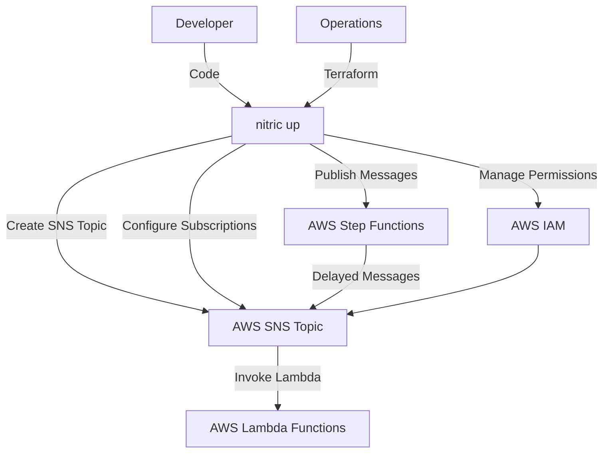
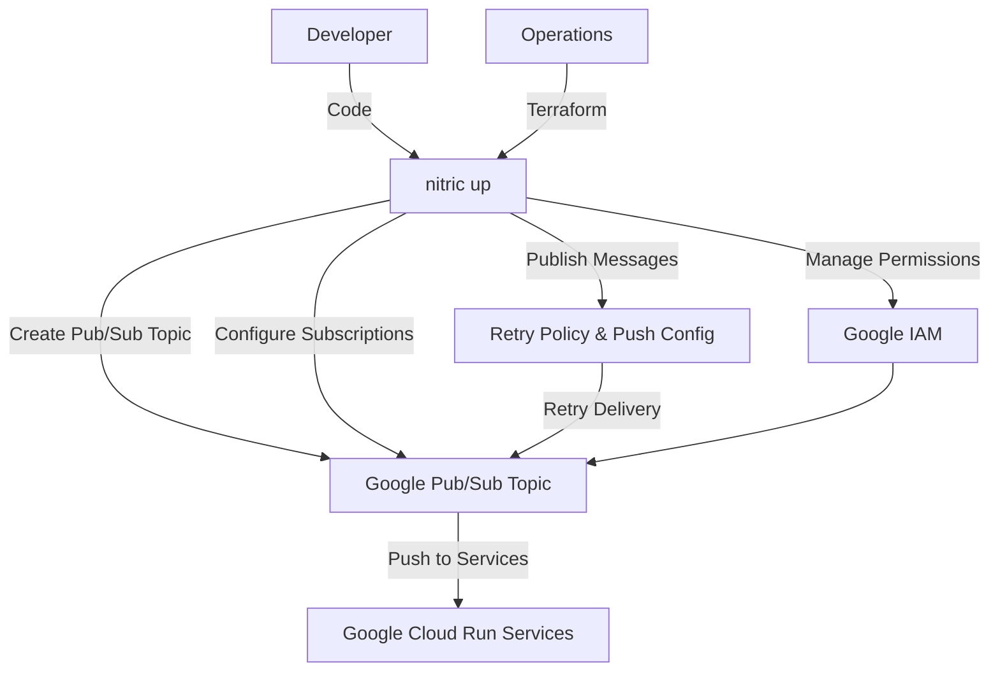
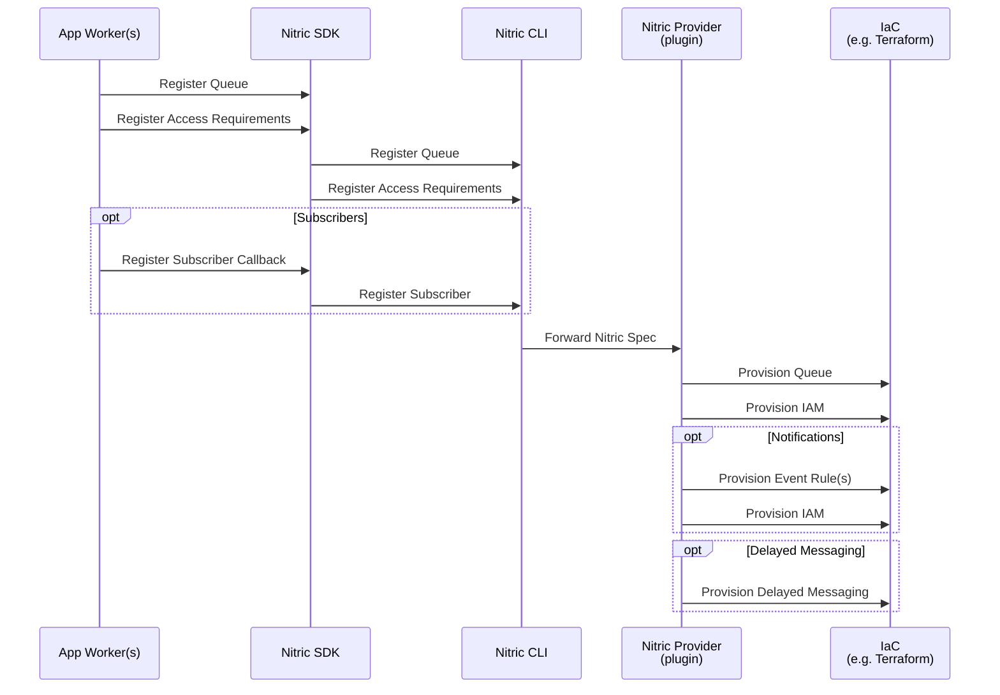
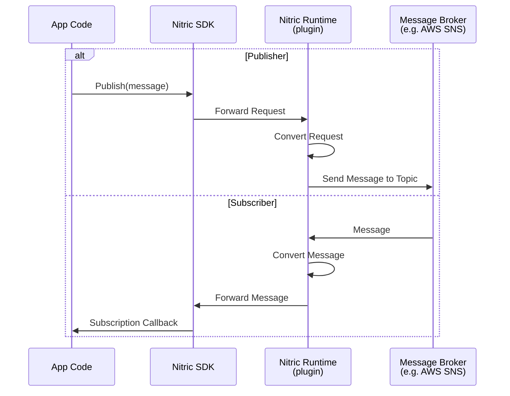

# Messaging - Topics

## 1. System Context

**Developers** use Nitric to define required topics to enable event-driven communication within their application.

- App code interacts with the [Topic resource](/messaging#topics) through defined topics and subscriptions.
- Developers define topics their application requires and implement application logic to publish or subscribe to messages.

**Operations** use default or overridden IaC (e.g Terraform modules) to provision the necessary resources for their target cloud.

  
Example AWS Provider

  
- **AWS SNS (Simple Notification Service)** serves as the messaging and event notification service.
- **AWS Lambda** functions are subscribed to SNS topics to process incoming messages.
- **AWS IAM** manages roles and policies for secure access to SNS topics and Lambda functions.
- **AWS Step Functions** make it possible to delay or schedule notifications, batch jobs, or any process that requires a timed pause before continuing with a task.

  
Example GCP Provider

- **Google Pub/Sub** serves as the messaging and event notification service.
- **Google Cloud Run** services are subscribed to Pub/Sub topics to process incoming messages.
- **Google IAM** manages roles and policies for secure access to Pub/Sub topics and Cloud Run services.
- **Retry Policy and Push Configuration** ensure reliable delivery and handling of messages to Cloud Run services.

## 2. Sequence

### Build Sequence

Below is a sequence diagram showing the sequence of events when a developer registers a Topic with Nitric and optionally registers Subscribers. This is the process that occurs when using the `nitric up` command.

### Runtime Sequence

Below is the runtime flow when performing operations on a Topic using Nitric, such as publishing or subscribing to messages. The example shows both publish and subscribe operations, which send or receive messages to/from the topic.

## 3. Component

### Topic Module

- Dynamically creates unique topics for messaging and event-driven communication, ensuring consistent naming and avoiding conflicts.
- Configures metadata or tags for resource identification, governance, and lifecycle management.
- Supports subscribing various endpoints (e.g., functions, services, queues) to the topic, enabling scalable publish-subscribe patterns.
- Automates the assignment of permissions to ensure secure publishing and subscription handling, following the principle of least privilege.
- Provides configurable retry policies and message delivery options to ensure reliable and fault-tolerant communication between services.
- Abstracts the underlying cloud messaging infrastructure, offering a unified interface for event-driven architectures across different providers.
- Optionally integrates with workflows or scheduling systems for advanced scenarios like delayed notifications or batched processing.

## 4. Code

**Developers** write application code that imports and declares the [Topic resource](/messaging#topics) from the SDK, and implements the application logic to publish and subscribe to topics.

SDK Reference by language -

- [NodeJS SDK](/reference/nodejs/topic/topic)
- [Python SDK](/reference/python/topic/topic)
- [Go SDK](/reference/go/topic/topic)
- [Dart SDK](/reference/dart/topic/topic)

**Operations** will use or extend the Nitric infrastructure modules, including both Terraform and Pulumi:

- Terraform Modules:
  - [AWS Topic Terraform Module](https://github.com/nitrictech/nitric/blob/main/cloud/aws/deploytf/.nitric/modules/topic/main.tf)
  - [GCP Topic Terraform Module](https://github.com/nitrictech/nitric/blob/main/cloud/gcp/deploytf/.nitric/modules/topic/main.tf)
- Pulumi Modules:
  - [AWS Topic Pulumi Module](https://github.com/nitrictech/nitric/blob/main/cloud/aws/deploy/topic.go)
  - [GCP Topic Pulumi Module](https://github.com/nitrictech/nitric/blob/main/cloud/gcp/deploy/topic.go)
  - [Azure Topic Pulumi Module](https://github.com/nitrictech/nitric/blob/main/cloud/azure/deploy/topic.go)
