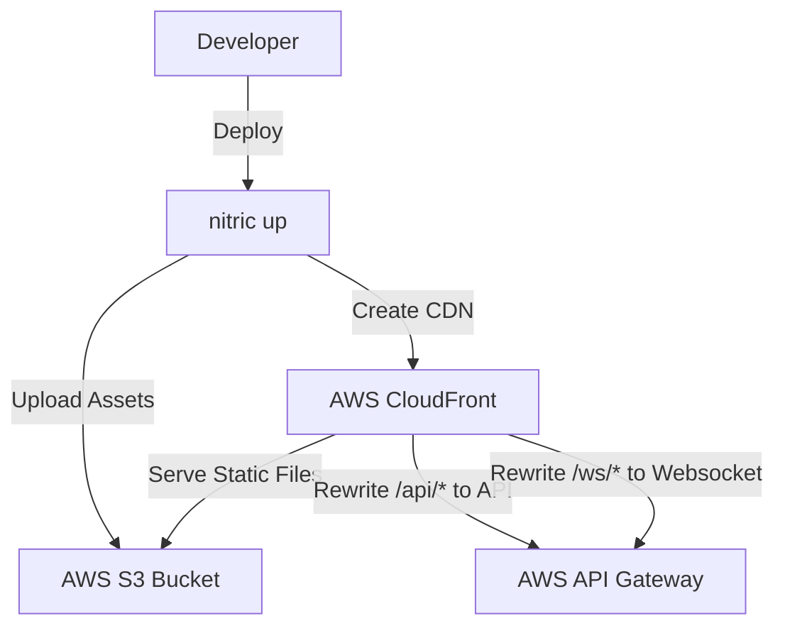
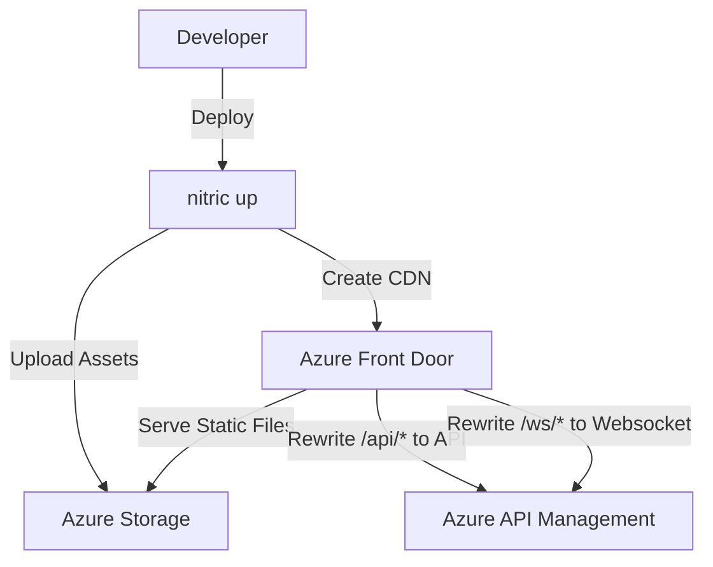
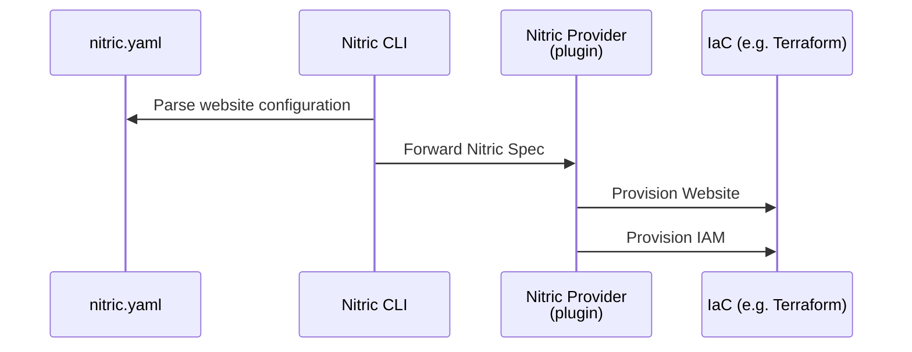

# Websites

## 1. System Context

**Developers** use Nitric to define required websites within their application.

- App code uses the [Website resource](/websites) defined in `nitric.yaml` to specify the websites and their configurations.
- Developers can configure base path, index pages, error pages, and other settings in their `nitric.yaml` file.
- When a website is defined, a single CDN endpoint is automatically created to serve the website content globally, including APIs and websockets as proxies.

**Operations** use default or overridden IaC (e.g., Terraform modules) to provision the necessary resources for their target cloud.

<details>
  <summary>Example AWS Provider</summary>

- **AWS S3** serves as the storage backend for static files (e.g., HTML, CSS, JS, images).
- **AWS CloudFront** is used to distribute the website globally and serve as a single entry point for the whole application.
- **AWS IAM** providers roles for access to the Website bucket



</details>

<details>
  <summary>Example Azure Provider</summary>
- **Static Website in Azure Blob Storage** serves as the storage backend for static files (e.g., HTML, CSS, JS, images).
- **Azure Front Door** is used to distribute the website globally and serve as a single entry point for the whole application.



</details>

## 2. Sequence

### Build Sequence

Below is the sequence of events that occur when a developer registers a website with Nitric:



## 3. Component

### Website Module

- Deploys website assets to a cloud-based storage solution for flexible and scalable hosting.
- Configures a distribution layer to serve the site globally, rewriting API endpoints to `/api/{apiName}` for consistent routing.
- Automatically invalidates the cache based on file changes, ensuring users always receive the latest content.

## 4. Code

**Developers** write yaml configuration to define the website and implement logic to serve static files.

### Nitric website configuration - nitric.yaml

```yaml
name: service-name
services:
  - match: ./services/*.js
    start: npm run dev:services $SERVICE_PATH
    runtime: node
runtimes:
  node:
    dockerfile: ./node.dockerfile
    args: {}
# The website configuration
websites:
  - basedir: ./my-website
    index: index.html
    error: 404.html
    build:
      command: npm run build
      output: ./dist
    dev:
      command: npm run dev -- --port 4322
      url: http://localhost:4322
```

### Access an API or Websocket from the website frontend

```javascript
// API Example
async function fetchData() {
  // due to apis being served from the same domain thanks to rewrites, no CORS is required
  const response = await fetch('/api/main/hello')
  const data = await response.json()
  console.log(data)
}

// Websocket Example
const ws = new WebSocket('/ws/chat')

ws.onmessage = (event) => {
  console.log(event.data)
}

ws.send('Hello, server!')
```

**Operations** will use or extend the Nitric infrastructure modules, including both Terraform and Pulumi:

- Terraform Modules:
  - [AWS Website Terraform Module](https://github.com/nitrictech/nitric/blob/main/cloud/aws/deploytf/.nitric/modules/website/main.tf)
  - [Azure Website Terraform Module](https://github.com/nitrictech/nitric/blob/main/cloud/azure/deploytf/.nitric/modules/website/main.tf)
  - [Google Cloud Website Terraform Module](https://github.com/nitrictech/nitric/blob/main/cloud/gcp/deploytf/.nitric/modules/website/main.tf)
- Pulumi Modules:
  - [AWS Website Pulumi Module](https://github.com/nitrictech/nitric/blob/main/cloud/aws/deploy/website.go)
  - [Azure Website Pulumi Module](https://github.com/nitrictech/nitric/blob/main/cloud/azure/deploy/website.go)
  - [Google Cloud Website Pulumi Module](https://github.com/nitrictech/nitric/blob/main/cloud/gcp/deploy/website.go)
