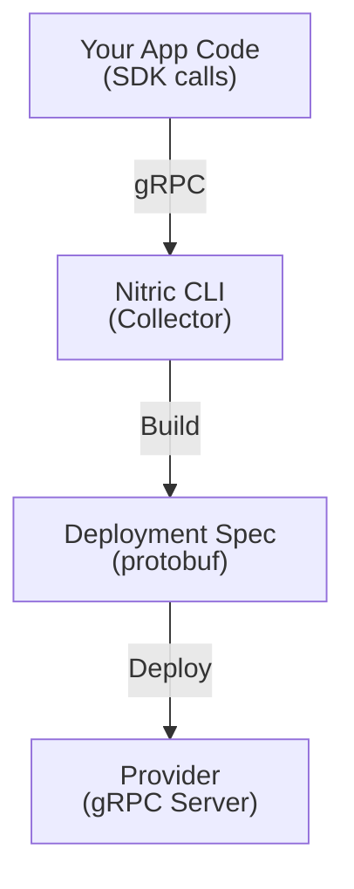

# Adding New Resource Types

This guide explains how to extend the Nitric CLI to support custom resource types, covering both deployment (`nitric up`) and local development (`nitric start`).

<Note>
  This guide is for contributors who want to add entirely new resource types to
  Nitric's core. If you want to replace existing resources in a provider or
  build a custom provider, see [Extending Standard Providers](./extend) or
  [Building Custom Providers](./create).
</Note>

## Overview

Adding a new resource type to Nitric requires changes across three repositories:

1. **nitric/core** - Proto definitions and gRPC service interfaces
2. **nitric/cli** - Resource collection, spec building, and local development
3. **Your custom provider** - Cloud-specific deployment logic

## Architecture

The following diagram shows how resources flow through the Nitric system:



Your application code makes SDK calls that are sent via gRPC to the Nitric CLI's collector. The collector builds a deployment spec (protobuf), which is then sent to your provider for cloud-specific resource creation.

## Part 1: Nitric Core Changes

The first step is defining your new resource type in the [nitric/core](https://github.com/nitrictech/nitric) repository.

### Clone the Repository

```bash
git clone https://github.com/nitrictech/nitric.git
```

### Add Resource Type Enum

The proto source files are in `nitric/proto/`, and Go code is generated into `core/pkg/proto/`.

In `nitric/proto/resources/v1/resources.proto`, add your new resource type to the `ResourceType` enum:

```protobuf title:nitric/proto/resources/v1/resources.proto
enum ResourceType {
  // ... existing types ...
  YourResourceType = N;  // Use the next available number
}
```

### Define Resource Proto Message

In the same file, add a message for your resource configuration:

```protobuf title:nitric/proto/resources/v1/resources.proto
message YourResource {
  // Resource-specific configuration fields
  string some_config = 1;
}
```

### Update ResourceDeclareRequest

Add your resource to the `ResourceDeclareRequest` oneof:

```protobuf title:nitric/proto/resources/v1/resources.proto
message ResourceDeclareRequest {
  ResourceIdentifier id = 1;
  oneof config {
    // ... existing configs ...
    YourResource your_resource = N;
  }
}
```

### Add Deployment Resource

If your resource needs deployment-specific configuration, update `nitric/proto/deployments/v1/deployments.proto`:

```protobuf title:nitric/proto/deployments/v1/deployments.proto
message YourDeploymentResource {
  // Deployment-specific fields (image URIs, targets, etc.)
}

message Resource {
  // In the config oneof:
  oneof config {
    // ... existing configs ...
    YourDeploymentResource your_resource = N;
  }
}
```

### Regenerate Proto Code

Run the proto generation in the `core` directory to create Go code from your proto definitions:

```bash
cd core && make generate-proto
```

## Part 2: CLI Changes - Resource Collection

These changes enable `nitric up` to collect your new resource type from application code.

### Update ServiceRequirements Struct

In `pkg/collector/service.go`, add a field for your new resource in the `ServiceRequirements` struct:

```go title:pkg/collector/service.go
type ServiceRequirements struct {
    // ... existing fields ...

    yourResources map[string]*resourcespb.YourResource
}
```

### Handle Resource Declaration

Add a case in the `Declare()` method to handle your resource type:

```go title:pkg/collector/service.go
func (s *ServiceRequirements) Declare(ctx context.Context, req *resourcespb.ResourceDeclareRequest) (*resourcespb.ResourceDeclareResponse, error) {
    s.resourceLock.Lock()
    defer s.resourceLock.Unlock()

    // ... existing validation ...

    switch req.Id.Type {
    // ... existing cases ...

    case resourcespb.ResourceType_YourResourceType:
        s.yourResources[req.Id.GetName()] = req.GetYourResource()
    }

    return &resourcespb.ResourceDeclareResponse{}, nil
}
```

### Initialize the Map

In `NewServiceRequirements()`, initialize your map:

```go title:pkg/collector/service.go
func NewServiceRequirements(serviceName string, serviceFile string, serviceType string) *ServiceRequirements {
    requirements := &ServiceRequirements{
        // ... existing initializations ...
        yourResources: make(map[string]*resourcespb.YourResource),
    }
    return requirements
}
```

### Update BatchRequirements

If your resource should be available to batch jobs, make similar changes in `pkg/collector/batch.go`:

1. Add field to `BatchRequirements` struct
2. Add case in `Declare()` method
3. Initialize in `NewBatchRequirements()`

### Build Deployment Spec

In `pkg/collector/spec.go`, create a builder function for your resource:

```go title:pkg/collector/spec.go
func buildYourResourceRequirements(allServiceRequirements []*ServiceRequirements, allBatchRequirements []*BatchRequirements, projectErrors *ProjectErrors) ([]*deploymentspb.Resource, error) {
    resources := []*deploymentspb.Resource{}

    for _, serviceRequirements := range allServiceRequirements {
        for resourceName, config := range serviceRequirements.yourResources {
            _, exists := lo.Find(resources, func(item *deploymentspb.Resource) bool {
                return item.Id.Name == resourceName
            })

            if !exists {
                res := &deploymentspb.Resource{
                    Id: &resourcespb.ResourceIdentifier{
                        Name: resourceName,
                        Type: resourcespb.ResourceType_YourResourceType,
                    },
                    Config: &deploymentspb.Resource_YourResource{
                        YourResource: &deploymentspb.YourDeploymentResource{
                            // Map configuration
                        },
                    },
                }
                resources = append(resources, res)
            }
        }
    }

    // Similar loop for batch requirements if needed

    return resources, nil
}
```

### Call Your Builder

Add your builder call in `ServiceRequirementsToSpec()`:

```go title:pkg/collector/spec.go
func ServiceRequirementsToSpec(...) (*deploymentspb.Spec, error) {
    // ... existing code ...

    yourResources, err := buildYourResourceRequirements(allServiceRequirements, allBatchRequirements, projectErrors)
    if err != nil {
        return nil, err
    }
    newSpec.Resources = append(newSpec.Resources, yourResources...)

    // ... rest of function ...
}
```

## Part 3: CLI Changes - Local Development

To support your new resource in `nitric start`, you'll need to implement a local service.

### Create Local Service

Create a new file `pkg/cloud/yourresource/yourresource.go`:

```go title:pkg/cloud/yourresource/yourresource.go
package yourresource

import (
    "context"
    "sync"

    "github.com/asaskevich/EventBus"
    yourpb "github.com/nitrictech/nitric/core/pkg/proto/yourresource/v1"
)

type LocalYourResourceState struct {
    // State that the dashboard/gateway needs to see
}

type LocalYourResourceService struct {
    stateLock sync.RWMutex
    state     LocalYourResourceState
    bus       EventBus.Bus
}

func (s *LocalYourResourceService) SubscribeToState(fn func(LocalYourResourceState)) {
    _ = s.bus.Subscribe("your_resource_topic", fn)
}

func (s *LocalYourResourceService) SomeMethod(ctx context.Context, req *yourpb.SomeRequest) (*yourpb.SomeResponse, error) {
    // Implementation
    return &yourpb.SomeResponse{}, nil
}

func NewLocalYourResourceService() (*LocalYourResourceService, error) {
    return &LocalYourResourceService{
        bus: EventBus.New(),
    }, nil
}
```

### Register with LocalCloud

In `pkg/cloud/cloud.go`:

1. Import your package:

```go title:pkg/cloud/cloud.go
import (
    // ... existing imports ...
    "github.com/nitrictech/cli/pkg/cloud/yourresource"
)
```

2. Add field to `LocalCloud` struct:

```go title:pkg/cloud/cloud.go
type LocalCloud struct {
    // ... existing fields ...
    YourResource *yourresource.LocalYourResourceService
}
```

3. Initialize in `New()` function:

```go title:pkg/cloud/cloud.go
func New(projectName string, opts LocalCloudOptions) (*LocalCloud, error) {
    // ... existing initializations ...

    localYourResource, err := yourresource.NewLocalYourResourceService()
    if err != nil {
        return nil, err
    }

    return &LocalCloud{
        // ... existing fields ...
        YourResource: localYourResource,
    }, nil
}
```

4. Wire into server plugins in `AddService()` and `AddBatch()`:

```go title:pkg/cloud/cloud.go
nitricRuntimeServer, _ := server.New(
    // ... existing plugins ...
    server.WithYourResourcePlugin(lc.YourResource),
    // ...
)
```

<Note>
  You'll need to add the `WithYourResourcePlugin` option to the nitric/core
  server package.
</Note>

### Update Local Resources Service

In `pkg/cloud/resources/resources.go`, if your resource should be tracked in the dashboard:

1. Add to `LocalResourcesState`:

```go title:pkg/cloud/resources/resources.go
type LocalResourcesState struct {
    // ... existing fields ...
    YourResources *ResourceRegistrar[resourcespb.YourResource]
}
```

2. Handle in `Declare()` method:

```go title:pkg/cloud/resources/resources.go
case resourcespb.ResourceType_YourResourceType:
    err = l.state.YourResources.Register(req.Id.Name, serviceName, req.GetYourResource())
```

3. Initialize in `NewLocalResourcesService()`:

```go title:pkg/cloud/resources/resources.go
YourResources: NewResourceRegistrar[resourcespb.YourResource](),
```

4. Clear in `ClearServiceResources()`:

```go title:pkg/cloud/resources/resources.go
l.state.YourResources.ClearRequestingService(serviceName)
```

## Part 4: Provider Implementation

Your custom provider receives the deployment spec via gRPC and creates cloud resources.

### Handle New Resource in Provider

In your provider's deployment handler, add a case for your resource type:

```go title:deploy/deploy.go
func (p *Provider) deployResource(resource *deploymentspb.Resource) error {
    switch resource.Id.Type {
    // ... existing cases ...

    case resourcespb.ResourceType_YourResourceType:
        config := resource.GetYourResource()
        // Create your cloud resource here using config
    }
    return nil
}
```

### Implement gRPC Runtime Service

If your resource has runtime operations (e.g., read/write), first create a service proto in `nitric/proto/yourresource/v1/yourresource.proto`:

```protobuf title:nitric/proto/yourresource/v1/yourresource.proto
syntax = "proto3";
package nitric.proto.yourresource.v1;

option go_package = "github.com/nitrictech/nitric/core/pkg/proto/yourresource/v1;yourresourcepb";

service YourResource {
  rpc Get (GetRequest) returns (GetResponse);
  rpc Set (SetRequest) returns (SetResponse);
  rpc Delete (DeleteRequest) returns (DeleteResponse);
}

// Define request/response messages...
```

See `nitric/proto/storage/v1/storage.proto` or `nitric/proto/kvstore/v1/kvstore.proto` for complete examples. Run `make generate-proto` again after adding this file.

Then implement the generated service interface in your provider.

## Part 5: Update go.mod

Point to your forked nitric/core:

```go title:go.mod
replace github.com/nitrictech/nitric/core => github.com/your-org/nitric/core v0.0.0-xxxxx
```

Or for local development:

```go title:go.mod
replace github.com/nitrictech/nitric/core => ../path/to/your/nitric/core
```

## Key Files Reference

| Purpose                     | File Path                          |
| --------------------------- | ---------------------------------- |
| Service resource collection | `pkg/collector/service.go`         |
| Batch resource collection   | `pkg/collector/batch.go`           |
| Spec building               | `pkg/collector/spec.go`            |
| Deployment flow             | `cmd/stack.go`                     |
| Provider interface          | `pkg/provider/provider.go`         |
| Deployment client           | `pkg/provider/client.go`           |
| Local cloud setup           | `pkg/cloud/cloud.go`               |
| Local resources             | `pkg/cloud/resources/resources.go` |

## Deployment Flow Summary

1. **Build** - CLI builds Docker images for services
2. **Collect** - CLI starts gRPC server, runs containers, collects resource declarations
3. **Spec** - CLI converts collected requirements to deployment spec
4. **Provider Start** - CLI starts provider binary
5. **Deploy** - CLI sends spec to provider via gRPC
6. **Events** - Provider streams deployment progress back to CLI

## Testing Your Changes

Build the CLI:

```bash
make build
```

Test resource collection:

```bash
./nitric up -s your-stack --debug
```

For local development testing:

```bash
./nitric start
```

## Notes

- The CLI uses proto definitions from `github.com/nitrictech/nitric/core`
- Proto packages are imported from `github.com/nitrictech/nitric/core/pkg/proto/*/v1`
- Resources must have valid names (checked by `validation.IsValidResourceName()`)
- Policies are handled specially - principals are auto-populated with service names
